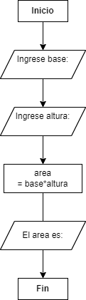
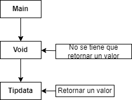
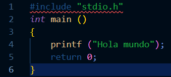
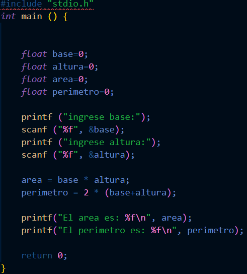
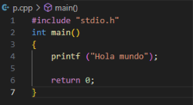
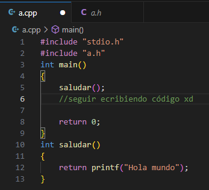

# Programación I

>16 de abril de 2025, clase 01 de Programación I

## ¿Qué es un IDE?

Un **IDE** es un Entorno de programación estructurad que se compone de:

1. **Lenguaje de Programación**: *(Debe estar instalado en tu pc)*.
2. **Compilador del Lenguaje a utilizar**: *Un programa que se encargará de ejecutar el código oque tu escribirás*.
3. **Editor de texto**: *Donde tu escribirás tu código*, es recomendable utilizar Visual studio code junto con sus extensiones para tener una mejor experiencia.
4. **Terminal de mi Lenguaje**: *Una ventana en la yo pueda ejecutar los comandos relacionados al lenguaje que voy a trabajar*.
5. **Git-Bash**: *Una herramienta para integrar tu proyecto en la red*.

## Algunos comandos clave para el terminal

>21 de abril de 2025, clase 02 de Programación I

### Algunos atajos de teclado para el Visual code

- *F1 o CTRL+ SHIFT+ P*: abre una barra de busqueda de comandos relacionados a las extenciones del visual, **ejemplo**: Abrir un preview o generar un pdf.
- *CTRL+ B*: Esconde la barra lateral que muestra a los archivos y/o workspaces abiertos.
- *AlT+ up,down,left,right*: me permite mover las líneas de mi código.
- *SHIFT+ ALT+ A*: me permite generar una multilinea.
- *CTRL+ SPACE*: activar sugerencias (para tomarlas usar **TAB**).
- *SHIFT+ ALT+ UP/DOWN*: copiar una línea de código.
- *CTRL+ P*: abrir rápidamente un proyecto.
- *CTRL+ D*: cursor múltiple.
- *CTRL+ T*: buscar símbolo o palabra que que hayas seleccionado.
- *CRTL+ K+ C*: el código que selecciones se convertirá en comentario
- *CTRL+ K+ U*: las líneas de comentarios seleccionadas dejarán de ser comentario.

### Comandos para el CMD o Powershell (win y Linux)

- **pdw**: muestra a que directorio está asociada la terminal
- **ls**: muestra los archivos de un directorio.
- **cd..**: la terminal se mueve un directorio más arriba.
- **touch *archivo.extensión*** , o en su defecto **touch directorio/*archivo.extensión*** para crear archivos.
- **ls** o **cat** o **code** ***archivo.extensión*** *(si hace falta, poner directorio antes del archivo)* para leer un archivo.
- **mkdir**: crear un directorio o carpeta.
- **rm *archivo.extensión*** *(agregue directorio antes del archivo si es necesario)* para eliminar un archivo.
- **cp *archivo(a copiar).extensión directorio/nombre de la copia.extensión*** para copiar un archivo dado.
- **mv *archivo.extensión* *directorio donde quieras mandarle*/** para mover un archivo de lugar o renombrarlo.
- **ps**: procesos activos
- **ipconfig**: para ver direcciones ip (incluso puedes ver la de tu router).
- **ping **web.com***: analiza la conexión con un sitio web.
- **echo "hola mundo">>*archivo.extensión***: inprime un mensaje en un arhivo dado.

### Algunos Comandos exclusivos del GIT

Nótese que siempre empiezan con "git"

-**git config --global -h**: ayuda para configurar cosas del GIT

- **git config --global user.name** / **email** para consultar con que credenciales el equipo esta registrado en la red del GIT. agregar *"usuario / email que quieras configurar"* despues del comando de arriba para configurar usuario y email.

Ojo! Debes configurar usuario y email para poder subir tu proyecto a la nube

- **git init**: iniciar el monitoreo de GIT (puntos de control) en el workspace en el que estás.
- **git add *archivo.extensión***: agregar un archivo al monitoreo de GIT.
    **git add .** agregará todos los archivos de un directorio al trakeo de GIT.
- **git status**: reporte de la situación por parte de GIT (lo que se modificó o sincronizó).
- **git commit -m *"mensaje"***: sincronizar cambios detectados por el GIT en los documentos que monitorea.
- **git++ *archivo.cpp -o ejecutable.exe***: para compilar un archivo de código de C.
- **directorio/archivo.exe**: para ejecutar un archivo .exe desde la consola.

>22 de abril de 2025, clase 03 de Programación

### GIT para la nube

- *git push*: para subir tu proyecto a un repositorio en la nube.
- *git pull*: para descargar código de un repositorio de la nube.
- *git clone URL.com*: para clonar un repositorio de la web.  

### Algunas carpetas importantes en tu Workspace

- **Bin**: binaries, los .exe generados despues de copilar código.
- **Lib**: librerías o bibliotecas a utilizar en el desarrollo.
- **Src**: donde se alojará el código base del proyecto
- **Database**: donde se encontrarán todos los archivos relacionados a los datos.
- **Tmp**: archivos temporales o auxiliares, puede alojar un archivo *gitignore*
- Si:  
    *touch  directorio/.gitignore*

    *echo "<*>.formato">>.gitignore*

     Imprimiré un parametro en *gitignore* para hacer que git no trakee a los archivos de cierto formto, esto es util con archivos .exe,.pdf,.htlm, ya que se generan cada que se compile un código.

📁 mi-proyecto/

├── 🔐 .env

├── ⚙️ bin/

│   └── 📜 setup.sh

├── 📚 lib/

│   └── 🧰 utils.js

├── 🗄️ database/

│   ├── 📄 schema.sql

│   └── 📄 seed_data.sql

├── 💻 src/

│   ├── 🧠 main.js

│   └── 📂 controllers/

│       └── 👤 userController.js

├── 🧹 temp/

│   └── 📁 cache/

└── 📘 README.md

## Branchs de GIT en tu Proyecto

Los diferentes puntos de control que crea GIT en tu proyecto se alojan a lo largo de una rama principal (tienen un id y hash asociados), aunque puedes crear más ramas paralelas que estrán dedicadas a desarrollar diferentes partes del proyecto. Toma en cuenta que al final del desarrollo las ramas se tendrán que unir de nuevo a la principal mediante una función "merge".

```
🌳 main
│
├── 🟢 ●Commit I
│
├── 🟢 ●Commit II
│
├── 🟢 ●Commit III
│     │
│     └── 🌿 feature/A
│          │
│          ├── 🟡 ● Desarrollo feature-A
│          ├── 🟡 ● Commit en freature-A
│          └── 🟡 ● Me muevo a la rama main
│
├── 🔵 ● Merge feature-A 
│
└── 🟢 ● Continuar desarrollo
```

>23 de arbril de 2025, clase 04 de Programación I

### Comandos Importantes para las Branchs de GIT

- *git branch*: muestra todas las ramas creadas
- *git branch -m nombre_nuevo*: renombrar una branch
- *git log*: listado de todos los puntos de control de tu branch

    *git log --graph*: agrega un pequeño dibujo al comando de arriba, recuerda salir del log con *q* (quit).
- **git checkout archivo.formato**: vuelve al último punto de control que haya guardado GIT.

    **git checkout *hash del punto de guardado***: para volver a un punto de control específico.
- **git tag *nombre_custom***: darle un nombre personalizados a tus commits o puntos de control (ver1 ,ver2, ver3, etc).
- *git diff*: reporta los cambios de código dados despues de un commit
- *git reset*:

## C/C++

>28 de abril de 2025, clase 05 de Programación I

### Manejo de Branchs en GIT

Pueden existir tantas branch como funcionalidades tenga el proyecto, algunas se encargarán de resolver problemas específicos como la aparición de errores críticos por medio de un "hotfix".

- **git branch *nombre***: crea y nombra un branch a partir de la rama principal. *la rama será creada a partir del último commit guardado en la rama madre.* 
- **git switch *nombre_rama_objetivo***:cambiar la rama en la que te encuentras por la que indicas en el comando.
- **git merge *rama_externa***: Une los elementos que tenga la rama mencionada (a partir de su último commit) en el comando con los elementos que tenga la rama en la que se encuentere en ese momento.

#### Unificar dos Ramas

Se hace un commit de la rama en la que se este trabajando, para luego cambiarse a la rama principal desde la cual se ha de ejecutar la función *merge*.

El proceso completo de drear una rama nueva, trabajar en ella y luego unir los cambios a la rama principal queda tal que:

-*git branch freatures*

-*git switch freatures*

-*git commit -m ""*

-*git switch main*

-*git merge fratures*

-*git branch -d freature*
(**opcional**: esta parte borra la rama mencionada en el comando)

>29 de abril de 2025, clase 06 de Programción I

### Integrar código en la nube

Se utiliarán los comandos *git push* y *git pull* para poder guardar tu código en la nube, tener en cuenta que los cambios realizados localmente se sincronizarán localmente con la nube una vez sean subidos a la nube.

Nótese que se necesita algún método de autentificación para poder utilizarse los comandos *pull* y *push*, uno de los métodos más comunes es generar dos llaves *ssh*: pública (para la nube) y otra privada (para el équipo).

Para crear las llaves *ssh*, primero se debe crear un directorio *.ssh* (oculto):

    cd ~
    pwd: */c/users/tu_usuario*
    mkdir .ssh
    cd .ssh
    pwd: */c/users/tu_usuario/.ssh*

Creación de la llave *ssh*:

    ssh-keygen -t ed25519 -C "github_email"
    *ingresar directorio y archivo para la key*

El comando te avisara cuáles serán tus claves privadas y públicas.

Ahora solo queda inciar el *ssh agent* para agregar tu *key* personal al equipo:

    eval "$(ssh-agent -s)"
    ssh-add ~/.ssh/*nombre_de_tu_key_privada*

Y por último tienes que agregar tu *key* pública a tu cuenta de github.

Ahora solo tienes que iniciar tu nube con: *git remote add origin git@github.com:user/repositorio.git*
ojo!!! debes crear tu repositorio en GITHUB primero.

    git remote add origin git@github.com:user/repositorio.git

No olvides comprobar la conexión con la nube con: *ssh -T git@github.com*, si dice que estas correctamente autenticado estas del otro lado!!

    ssh -T git@github.com

Para tu primer push has de usar: **git push -u origin *branch***

>4 de abril de 2025, clase 07 de Programación I

## Programación orientada a objetos

Cuando se requiere solucionar un problema por medio de la programación, irónicamente programar es lo último que se hará en dicho proceso; Para solucionar un problema de cualquier tipo se seguirá el siguiente procedimiento:

1. Encontrar un patrón.
2. Hacer un algoritmo
3. Convertir algoritmo en código.

En otras palabras, programar implica trabajar con *algoritmia* antes de siquiera programar; por ejemplo, si quisiera hacer un programa para calcular el área de un cuadrilatero dado, sería buena idea representar su solución por medio de un algoritmo y pseudocódigo plasmados en un diagrama de flujo.



Dentro de la programación estructurada se trabajarán con espacios de memoria llamados *bloques*, algunos de estos bloques estrán destinados a procedimientos especiales (*Void*) y otros a guardar variables para luego regresar un resultado, estos dos tipos de bloque trabajarán con otro bloque llamado *main*.



Para empezar a programar:

Se necesita incluir la biblioteca que alamacena las funciones básicas a utilizar, llamar al bloque main ya sea por medio de void o un *tipo de dato* y en caso de usar algun tipo de dato se debe retornar un valor que concuerde con dicho tipo de dato al final del código; 
todo esto se hace con la finalidad de que el compilador sepa como leer el código que escribimos (*empieza a leer al identificar a main*).



## C/C++

Este lenguaje es medio rarito y un tanto elemental, por lo que muchos de sus procesos resultarán algo más tediosos comparados con otros lenguajes con syntaxis más simples; por ejemplo, en python o mathlab no se tienen que especificar un tipo de dato cuando se requiere declarar una variable, en C o C++ si, y hablando de tipos de datos/variables...

### Tipos de datos

En una variable podrás guardar diferentes tipos de variables tales como:

- **int**: números enteros.
- **float**: números decimales.
- **double**:  decimales que requieren mayor precisión (3.1416...,*e*).
- **bool**: variables de tipo booleano (*true*,*false*).
- **char**: caracter individual (*A*).

Estos son los tipos de datos más básicos que pueden haber en C/C++, desde luego hay más tipos de datos pero derivados de los anteriores.

### Problemas

#### Ejercicio 1

Haga un programa que pueda calcular el área y perimetro de un rectangulo en base a los datos proporcionados por el usuario.

-Recordamos el algoritmo que representamos más arriba, para el cual necesitamos *imprimir* un mensaje al usuario y utilizar una función *input* para que el usuario pueda introducir los datos del problema, posteriormente se procederá al cálculo y se *imprimirá* el resultado:

De tal forma que se utilizarán las funciones: *printf ("")* y *scanf("%tip_dato",&variable)* contenidas en la libreria: *"stdio.h"*

- Empezamos por llamar a la librería: *#include "stdio.h"*
- Llamamos a main:                    *int main ()*
- Abrimos llaves y declaramos las variables necesarias: *{ float base=0; float altura=0; float area=0;float perimetro=0;* 
- Las variables valdrán 0 en un inicio aunque se les asignará un valor más tarde, no olvides especificar que tipo de dato se guardará en una variable.
- Mostramos los mensajes necesarios: *printf ("ingresa base")*; *printf ("ingresa altura")*; *printf ("el area es")*; *printf ("el perimetro es")*.
- Escribimos los inputs: *scanf ("%f", &base)*; *sacnf ("%f", &altura)*.
- Nótece que la incial al lado del porcentaje corresponde al tipo de dato en el que se quiere guardar el input.
- El cálculo: *area= base x altura*; *perimetro= 2 x (altura+base)*
- Como no usamos un void tenemos que retornar un valor: *return 0;*
- Cerramos llaves: *}*

Realizamos el proceso tal que:



- El \n al final de cada print supone que el texto impreso se salte una linea entre prints.

        #include "stdio.h"

        int main(){
        float area=0;

        float perimetro=0;

        float base=0;

        float altura=0;

        printf ("ingresar base:\n")

        scanf ("%f", &base)

        printf ("ingresar altura:\n")

        scanf ("%f", &altura)

        area = base * altura

        perimetro = 2 * (base * altura)

        printf ("el area es:%f\n",area)

        printf ("el perimetro es:%f\n",perimetro)

        return 0;

        }

>5 de mayo de 2025, clase 08 de Programación I.


>6 de mayo de 2025, clase 09 de Programación I.

#### Refactorizar tu código

Dentro de la programación, el refactorizar es un proceso de mejorar el código existente sin cambiar su comportamiento, de tal manera que nuestro programa sea más facil de entender.

Para entender mejor este concepto partimos de:

 

Podemos extraer la función "*printf*" por medio del atajo *Ctrl + Shift + R* y nombrarla como queramos aunque es preferible que el nombre sea un verbo en infintivo que describa la función al guardar:



Al hacer este proceso tambien he creado un archivo .c que tendrá el nombre de mi archivo .cpp y que contendrá la función o las funciones que refactorizaré a futuro dentro de mi archivo .cpp, por lo que se tendrá que llamar a esa biblioteca para usar la función guardada.

Nótese que en mi bloque principal la función "*printf*" se convirtió en "*saludar()*" y al terminar el bloque saludar empieza otro bloque que define a que refiere la función "*saludar()*"