# Programación I

>16 de abril de 2025, clase 01 de Programación I

## ¿Qué es un IDE?

Un **IDE** es un Entorno de programación estructurad que se compone de:

1. **Lenguaje de Programación**: *(Debe estar instalado en tu pc)*.
2. **Compilador del Lenguaje a utilizar**: *Un programa que se encargará de ejecutar el código oque tu escribirás*.
3. **Editor de texto**: *Donde tu escribirás tu código*, es recomendable utilizar Visual studio code junto con sus extensiones para tener una mejor experiencia.
4. **Terminal de mi Lenguaje**: *Una ventana en la yo pueda ejecutar los comandos relacionados al lenguaje que voy a trabajar*.
5. **Git-Bash**: *Una herramienta para integrar tu proyecto en la red*.

## Algunos comandos clave para el terminal

>21 de abril de 2025, clase 02 de Programación I

### Algunos atajos de teclado para el Visual code

- *F1 o CTRL+ SHIFT+ P*: abre una barra de busqueda de comandos relacionados a las extenciones del visual, **ejemplo**: Abrir un preview o generar un pdf.
- *CTRL+ B*: Esconde la barra lateral que muestra a los archivos y/o workspaces abiertos.
- *AlT+ up,down,left,right*: me permite mover las líneas de mi código.
- *SHIFT+ ALT+ A*: me permite generar una multilinea.
- *CTRL+ SPACE*: activar sugerencias (para tomarlas usar **TAB**).
- *SHIFT+ ALT+ UP/DOWN*: copiar una línea de código.
- *CTRL+ P*: abrir rápidamente un proyecto.
- *CTRL+ D*: cursor múltiple.
- *CTRL+ T*: buscar símbolo o palabra que que hayas seleccionado.
- *CRTL+ K+ C*: el código que selecciones se convertirá en comentario
- *CTRL+ K+ U*: las líneas de comentarios seleccionadas dejarán de ser comentario.

### Comandos para el CMD o Powershell (win y Linux)

- **pdw**: muestra a que directorio está asociada la terminal
- **ls**: muestra los archivos de un directorio.
- **..\directorio\archivo**: navegar por un directorio.
- **cd..**: la terminal se mueve un directorio más arriba.
- **touch *archivo.extensión*** , o en su defecto **touch directorio/*archivo.extensión*** para crear archivos.
- **ls** o **cat** o **code** ***archivo.extensión*** *(si hace falta, poner directorio antes del archivo)* para leer un archivo.
- **mkdir**: crear un directorio o carpeta.
- **rm *archivo.extensión*** *(agregue directorio antes del archivo si es necesario)* para eliminar un archivo.
- **cp *archivo(a copiar).extensión directorio/nombre de la copia.extensión*** para copiar un archivo dado.
- **mv *archivo.extensión* *directorio donde quieras mandarle*/** para mover un archivo de lugar o renombrarlo.
- **ps**: procesos activos
- **ipconfig**: para ver direcciones ip (incluso puedes ver la de tu router).
- **ping **web.com***: analiza la conexión con un sitio web.
- **echo "hola mundo">>*archivo.extensión***: inprime un mensaje en un arhivo dado.

### Algunos Comandos exclusivos del GIT

Nótese que siempre empiezan con "git"

-**git config --global -h**: ayuda para configurar cosas del GIT

- **git config --global user.name** / **email** para consultar con que credenciales el equipo esta registrado en la red del GIT. agregar *"usuario / email que quieras configurar"* despues del comando de arriba para configurar usuario y email.

Ojo! Debes configurar usuario y email para poder subir tu proyecto a la nube

- **git init**: iniciar el monitoreo de GIT (puntos de control) en el workspace en el que estás.
- **git add *archivo.extensión***: agregar un archivo al monitoreo de GIT.
    **git add .** agregará todos los archivos de un directorio al trakeo de GIT.
- **git status**: reporte de la situación por parte de GIT (lo que se modificó o sincronizó).
- **git commit -m *"mensaje"***: sincronizar cambios detectados por el GIT en los documentos que monitorea.
- **git++ *archivo.cpp -o ejecutable.exe***: para compilar un archivo de código de C.
- **directorio/archivo.exe**: para ejecutar un archivo .exe desde la consola.

>22 de abril de 2025, clase 03 de Programación

### GIT para la nube

- *git push*: para subir tu proyecto a un repositorio en la nube.
- *git pull*: para descargar código de un repositorio de la nube.
- *git clone URL.com*: para clonar un repositorio de la web.  

### Algunas carpetas importantes en tu Workspace

- **Bin**: binaries, los .exe generados despues de copilar código.
- **Lib**: librerías o bibliotecas a utilizar en el desarrollo.
- **Src**: donde se alojará el código base del proyecto
- **Database**: donde se encontrarán todos los archivos relacionados a los datos.
- **Tmp**: archivos temporales o auxiliares, puede alojar un archivo *gitignore*
- Si:  
    *touch  directorio/.gitignore*

    *echo "<*>.formato">>.gitignore*

     Imprimiré un parametro en *gitignore* para hacer que git no trakee a los archivos de cierto formto, esto es util con archivos .exe,.pdf,.htlm, ya que se generan cada que se compile un código.

📁 mi-proyecto/

├── 🔐 .env

├── ⚙️ bin/

│   └── 📜 setup.sh

├── 📚 lib/

│   └── 🧰 utils.js

├── 🗄️ database/

│   ├── 📄 schema.sql

│   └── 📄 seed_data.sql

├── 💻 src/

│   ├── 🧠 main.js

│   └── 📂 controllers/

│       └── 👤 userController.js

├── 🧹 temp/

│   └── 📁 cache/

└── 📘 README.md

## Branchs de GIT en tu Proyecto

Los diferentes puntos de control que crea GIT en tu proyecto se alojan a lo largo de una rama principal (tienen un id y hash asociados), aunque puedes crear más ramas paralelas que estrán dedicadas a desarrollar diferentes partes del proyecto. Toma en cuenta que al final del desarrollo las ramas se tendrán que unir de nuevo a la principal mediante una función "merge".

```
🌳 main
│
├── 🟢 ●Commit I
│
├── 🟢 ●Commit II
│
├── 🟢 ●Commit III
│     │
│     └── 🌿 feature/A
│          │
│          ├── 🟡 ● Desarrollo feature-A
│          ├── 🟡 ● Commit en freature-A
│          └── 🟡 ● Me muevo a la rama main
│
├── 🔵 ● Merge feature-A 
│
└── 🟢 ● Continuar desarrollo
```

>23 de arbril de 2025, clase 04 de Programación I

### Comandos Importantes para las Branchs de GIT

- *git branch*: muestra todas las ramas creadas
- *git branch -m nombre_nuevo*: renombrar una branch
- *git log*: listado de todos los puntos de control de tu branch

    *git log --graph*: agrega un pequeño dibujo al comando de arriba, recuerda salir del log con *q* (quit).
- **git checkout archivo.formato**: vuelve al último punto de control que haya guardado GIT.

    **git checkout *hash del punto de guardado***: para volver a un punto de control específico.
- **git tag *nombre_custom***: darle un nombre personalizados a tus commits o puntos de control (ver1 ,ver2, ver3, etc).
- *git diff*: reporta los cambios de código dados despues de un commit
- *git reset*:

## C/C++

>28 de abril de 2025, clase 05 de Programación I

### Manejo de Branchs en GIT

Pueden existir tantas branch como funcionalidades tenga el proyecto, algunas se encargarán de resolver problemas específicos como la aparición de errores críticos por medio de un "hotfix".

- **git branch *nombre***: crea y nombra un branch a partir de la rama principal. *la rama será creada a partir del último commit guardado en la rama madre.* 
- **git switch *nombre_rama_objetivo***:cambiar la rama en la que te encuentras por la que indicas en el comando.
- **git merge *rama_externa***: Une los elementos que tenga la rama mencionada (a partir de su último commit) en el comando con los elementos que tenga la rama en la que se encuentere en ese momento.

#### Unificar dos Ramas

Se hace un commit de la rama en la que se este trabajando, para luego cambiarse a la rama principal desde la cual se ha de ejecutar la función *merge*.

El proceso completo de drear una rama nueva, trabajar en ella y luego unir los cambios a la rama principal queda tal que:

    git branch  //poner rama aquí

    git switch //rama a la que cambiarse

    git commit -m "//mensaje del commit"

    git switch main

    git merge //rama con la que quieras unir los cambios

    git branch -d //rama a eleminar
(**opcional**: esta parte borra la rama mencionada en el comando)

>29 de abril de 2025, clase 06 de Programción I

### Integrar código en la nube

Se utiliarán los comandos *git push* y *git pull* para poder guardar tu código en la nube, tener en cuenta que los cambios realizados localmente se sincronizarán localmente con la nube una vez sean subidos a la nube.

Nótese que se necesita algún método de autentificación para poder utilizarse los comandos *pull* y *push*, uno de los métodos más comunes es generar dos llaves *ssh*: pública (para la nube) y otra privada (para el équipo).

Para crear las llaves *ssh*, primero se debe crear un directorio *.ssh* (oculto):

    cd ~
    pwd: */c/users/tu_usuario*
    mkdir .ssh
    cd .ssh
    pwd: */c/users/tu_usuario/.ssh*

Creación de la llave *ssh*:

    ssh-keygen -t ed25519 -C "github_email"  
    
    *ingresar directorio y archivo para la key*

El comando te avisara cuáles serán tus claves privadas y públicas.

Ahora solo queda inciar el *ssh agent* 

    eval "$(ssh-agent -s)"

para agregar tu *key* personal al equipo:

    ssh-add ~/.ssh/*nombre_de_tu_key_privada*

Y por último tienes que agregar tu *key* pública a tu cuenta de github.

Ahora solo tienes que iniciar tu nube con: *git remote add origin git@github.com:user/repositorio.git*
ojo!!! debes crear tu repositorio en GITHUB primero.

    git remote add origin git@github.com:user/repositorio.git

No olvides comprobar la conexión con la nube con: *ssh -T git@github.com*, si dice que estas correctamente autenticado estas del otro lado!!

    ssh -T git@github.com

Para tu primer push has de usar: **git push -u origin *branch***

>4 de abril de 2025, clase 07 de Programación I

## Programación orientada a objetos

Cuando se requiere solucionar un problema por medio de la programación, irónicamente programar es lo último que se hará en dicho proceso; Para solucionar un problema de cualquier tipo se seguirá el siguiente procedimiento:

1. Encontrar un patrón.
2. Hacer un algoritmo
3. Convertir algoritmo en código.

En otras palabras, programar implica trabajar con *algoritmia* antes de siquiera programar; por ejemplo, si quisiera hacer un programa para calcular el área de un cuadrilatero dado, sería buena idea representar su solución por medio de un algoritmo y pseudocódigo plasmados en un diagrama de flujo.


Dentro de la programación estructurada se trabajarán con espacios de memoria llamados *bloques*, algunos de estos bloques estrán destinados a procedimientos especiales (*Void*) y otros a guardar variables para luego regresar un resultado, estos dos tipos de bloque trabajarán con otro bloque llamado *main*.


Para empezar a programar:

Se necesita incluir la biblioteca que alamacena las funciones básicas a utilizar, llamar al bloque main ya sea por medio de void o un *tipo de dato* y en caso de usar algun tipo de dato se debe retornar un valor que concuerde con dicho tipo de dato al final del código; 
todo esto se hace con la finalidad de que el compilador sepa como leer el código que escribimos (*empieza a leer al identificar a main*).


## C/C++

Este lenguaje es medio rarito y un tanto elemental, por lo que muchos de sus procesos resultarán algo más tediosos comparados con otros lenguajes con syntaxis más simples; por ejemplo, en python o mathlab no se tienen que especificar un tipo de dato cuando se requiere declarar una variable, en C o C++ si, y hablando de tipos de datos/variables...

### Tipos de datos

En una variable podrás guardar diferentes tipos de variables tales como:

- **int**: números enteros.
- **float**: números decimales.
- **double**:  decimales que requieren mayor precisión (3.1416...,*e*).
- **bool**: variables de tipo booleano (*true*,*false*).
- **char**: caracter individual (*A*).

Estos son los tipos de datos más básicos que pueden haber en C/C++, desde luego hay más tipos de datos pero derivados de los anteriores.

### Problemas Básicos

#### Ejercicio 1

Haga un programa que pueda calcular el área y perimetro de un rectangulo en base a los datos proporcionados por el usuario.

-Recordamos el algoritmo que representamos más arriba, para el cual necesitamos *imprimir* un mensaje al usuario y utilizar una función *input* para que el usuario pueda introducir los datos del problema, posteriormente se procederá al cálculo y se *imprimirá* el resultado:

De tal forma que se utilizarán las funciones: *printf ("")* y *scanf("%tip_dato",&variable)* contenidas en la libreria: *"stdio.h"*

- Empezamos por llamar a la librería: *#include "stdio.h"*
- Llamamos a main:                    *int main ()*
- Abrimos llaves y declaramos las variables necesarias: *{ float base=0; float altura=0; float area=0;float perimetro=0;* 
- Las variables valdrán 0 en un inicio aunque se les asignará un valor más tarde, no olvides especificar que tipo de dato se guardará en una variable.
- Mostramos los mensajes necesarios: *printf ("ingresa base")*; *printf ("ingresa altura")*; *printf ("el area es")*; *printf ("el perimetro es")*.
- Escribimos los inputs: *scanf ("%f", &base)*; *sacnf ("%f", &altura)*.
- Nótece que la incial al lado del porcentaje corresponde al tipo de dato en el que se quiere guardar el input.
- El cálculo: *area= base x altura*; *perimetro= 2 x (altura+base)*
- Como no usamos un void tenemos que retornar un valor: *return 0;*
- Cerramos llaves: *}*

Realizamos el proceso tal que:


- El \n al final de cada print supone que el texto impreso se salte una linea entre prints.
- Si quiero limitar el número de decimales que se mostrarán en la impresión, puedo utilizar la expresión *.n* despues del "*%*", donde *n* es el número de cifras decimales que quiero mostar en la respuesta

>5 de mayo de 2025, clase 08 de Programación I.

>6 de mayo de 2025, clase 09 de Programación I.

### Refactorizar tu código

Dentro de la programación, el refactorizar es un proceso de mejorar el código existente sin cambiar su comportamiento, de tal manera que nuestro programa sea más facil de entender.

Para entender mejor este concepto partimos de:

 

Podemos extraer la función "*printf*" por medio del atajo *Ctrl + Shift + R* y nombrarla como queramos aunque es preferible que el nombre sea un verbo en infintivo que describa la función al guardar:


Al hacer este proceso tambien he creado un archivo .c que tendrá el nombre de mi archivo .cpp y que contendrá la función o las funciones que refactorizaré a futuro dentro de mi archivo .cpp, por lo que se tendrá que llamar a esa biblioteca para usar la función guardada.

Nótese que en mi bloque principal la función "*printf*" se convirtió en "*saludar()*" y al terminar el bloque saludar empieza otro bloque que define a que refiere la función "*saludar()*". Con esto se espera resumir un pedazo de código recurrente bajo un "*nombre clave*" a costa de tener que definir que significa ese nombre clave dentro del código del proyecto.

-Advertencia: toda variable guardada dentro de una función o procedimiento refactorizado funcionará a nivel local, es decir, solo valdrá dentro de la función o procedimiento "*guardado*". Si quieres guardar una variable de manera global, lo tendras que hacer en el bloque principal.

>07 de mayo de 2025, clase 10 de Programación I

>12 de mayo de 2025 , clase 11 de Programación I

### Arreglos (*Arrays*)

Cuando se habla de *arrays* se refiere a una colección de variables de un mismo tipo de dato que se almacenan en memoria, en pocas palabras, se habla de vectores y matrices que almacenan variables.

Por ejemplo, si quieres guardar la edad de 6 personas en una variable.

La forma de declarar una fila es: *tipo_dato* *nombre* *[i]* = *{0,1,2,....i}* , donde *i* es el número de datos en la fila (debes ingresar los datos dentro de las llaves). Ojo!, los elementos de la fila se enumeran desde 0.

Tal que:


Tambien puedo modificar los valores de los diferentes elementos de la fila de la siguiente manera:
*nombre* *[i]* = *valor_iésima_fila*


Nótese que toda la fila de datos tiene asignada un nombre de variable (*edades* en este caso) y que tambien puedo referirme a cada elemento de la fila de datos por separado con el nombre del arreglo y su identificador "*[i]*", de tal manera que puedo escribir:

        printf ("%d\n", array[i])
por ejemplo

O puedo tambien utilizar un bucle para imprimir los elementos de la fila de datos:

        for (size_t i = 0; i < 5; i++)
    {
        printf ("ingrese el valor para el elemento\n");
        scanf("%d",&arreglo[i]);
    }
    for (size_t i = 0; i < 5; i++)
    {
        printf("%d\n",arreglo[i]);
    }

y hablando de bucles....

>13 de mayo de 2025, clase 12 de Programación I

### Bucles

La estructura clave para inciar un bucle es:

**for (inicio, condicion, incremento)**

        for (data_type i = 0; i < n; i++)
        {
        //Poner una función
        }

Un bucle es un procedimiento encargado de repetir una serie de instrucciones en cierto intervalo de valores para i; donde i es un número entero en el que se comienza y n en el que el bucle finaliza, lo que lo hace especialmente útil a la hora de trabajar con un arreglo debido a que se requiere trabajar de la manera más abreviada posible con los múltiples elementos que puede tener un fila de datos.

En este caso, el i++ significa que el valor de i aumenta en 1 en cada iteración del bucle de tal manera que i=1+i; aunque tambien puedo asignarle más condiciones a mi bucle, como por ejemplo: i=2+i, y lo podría combinar con un printf para imprimir números pares en consola cuantas veces lo diga *n*.

Un bucle tambien se puede dar mediante las palabras clave *while* y *do while* tal que:

while *condición*
    //alguna instrucción, *incremento*;:

do
{
    //alguna instrucción, *incremento*;:
}
while *condición*: //i<final

**Advertencia:** Es recomendable que los valores de *i* y *n* sean variables, no asignarles valor directamente.

>14 de mayo de 2025, clase 13 de Programación I.

### Series

#### Ejercicios

1. Imprima "*+*" en la consola 6 veces utilizando un bucle.

**Con la primera estructura**


**Con una extuctura alternativa**


**Resultado:**

➕	➕	➕	➕	➕	➕

2. Haga una serie de 10 elementos que alterne entre "*+*" y "*-*" empezando por "*+*".

Analicemos primero a que número de la serie le corresponde cada caracter:

    1  2  3  4  5 
    +  -  +  -  + 

Podemos notar que si empezamos por "*+*", a cada "*+*" le corresponde el número impar y a cada "*-*" le corresponde el número par, por lo que debemos:

- Definir "*+*" y "*-*" en términos de variables (*char*).
- **Distinguir entre números pares e impares**.- Sabemos que todo número par es divisible para 2, por lo que su residuo al dividirlo entre 2 es 0, y para todo número impar su residuo será diferente de 0, tal que: i %2=0 si es par y i %2=0 si es impar, donde "*%*" indica el residuo de la división entre "*i*" y "*2*".
- **Usar un condicional para alternar entre "*+*" y "*-*"**.- Para iniciar un condicional se utiliza la palabra clave *if* para establecer una condición a cumplir, si se cumple la condición indicar una instrucción y si no se cumple dicha condición indicar otra instrucción mediante la palabra clave *else*.

**Con la primera estructura:**


**Con una estructura alternativa:**

    

**Resultado:**

➕	➖	➕	➖	➕	➖	➕	➖	➕ ➖

3. Imprima una serie de Fibonacci en la consola, el número de elementos que tendrá la sucesión será definida por el usuario.

- **Definir la serie de Fibonacci:**- La serie de Fibonacci es una secuencia de números en la que cada número es la suma de los dos números anteriores; podemos empezar definiendo en variables los primeros números de la serie tal que uno sea el sucesivo del otro, en este caso podemos definir un "*a=0*" y un "*b=1*", la idea es que a adquiera el valor de "*b*" y que "*b*" adquiera el valor de "*a+b*", pero este "*a+b*" debe contener los valores "originales de "*a*" y "*b*" antes de que "actualicen" tal que necesitamos definir una variable c que contenga el valor de "*a+b*" antes de actualizar "*a*" y "*b*"; el elemento que se tendrá que imprimir en consola será el valor de "*a*".
- **Introducir instrucción dentro del bucle**.- es necesario introducir nuestra función "*printf ("%d",a)*" dentro de un bucle para que *printf* se repita tantas veces como queramos.
- **Usar un "input" para definir el número de elementos**.- se tendrá que declarar una variable que contenga el valor que el usuario introduzca en la consola y que al mismo tiempo hará de condición en nuestro bucle *(i<n)*.

**Resolución**


4.- *Anidar bucles*: es la acción de generar un bucle dentro de otro bucle, de tal forma que puedes generar algunas interacciones muy curiosas. Por ejemplo, si quieres imprimir dos caracteres alternados tantas veces como sea el número de elementos de una serie de Fibonacci, puedes hacerlo de la siguiente manera:

- Crear un bucle principal que contenga a la serie de Fibonacci.
- generar otro bucle antes de cerrar el bucle principal que contenga como condición de final a cada número que se imprimirá en la sucesión de Fibonacci. Tal que:

    Fibonacci: 0

    Fibonacci: 1
    -> Repetición 1

    Fibonacci: 1
  -> Repetición 1

    Fibonacci: 2
  -> Repetición 1
  -> Repetición 2

    Fibonacci: 3
  -> Repetición 1
  -> Repetición 2
  -> Repetición 3

- Usar un condicional (dentro del segundo bucle) que alterne entre dos caracteres, tal que si el número de repetición es par imprima un "*-*" y si es impar un "*+*".

**Resolución:**


5. Imprima en la consola "- ++ --- ++++" ... sucesivamente.

- Ya te la sabes , solo tienes que hacer un bucle dentro de otro bucle que contenga un condicional que alterne entre los caracteres con algunas variaciones.

**Resolución:**


### Imprimir dibujos

¿Sabías que puedes crear un plano cartesiano usando dos bucles anidados?

Si:

        #include "stdio.h"
        int main()
        { 
        for (int i=0; i<size; i++){
            
            for (int j=0; j<size; j++){
                //Poner condicional
        }
        } printf ("\n") 
        return 0;
        }

El bucle anidado se representaría: *(0, 0 1 2)\n; (1; 0 1 2)\n; (2; 0 1 2)\n*, tal que se tienen los siguientes **pares ordenados**: 


*Si esto no es algebra lineal, no se qué lo será*

**Advertencia**: *para esta funcionalidad, prioriza utilizar la estructura "for" y empezar cada bucle desde 0, para evitar problemas de indexación*.

Puedes jugar con este *plano cartesiano* y un condicional para imprimir diferentes figuras y letras en la consola. por ejemplo, si elijes un tamaño de 4x4 *(el tamaño es el término despues de "<" en cada bucle)*, puedes dibujar una "X" con el siguiente condicional


*"||" dentro de un condicional marcan una disyunción y "&&" una conjunción*

*Nótese que las condiciones puestas son la definción matemática para la diagonal principal y secundaria de una matriz en Álgebra Lineal.*

Para dibujar una "P":


*En este caso las lineas verticales y horizontales se dibujan como en una plano cartesiano, tomar en cuenta que los bucles no cuentan hasta el "tamaño" sino hasta un número menor, razón que para dibujar la linea vertical a la última columna se utiliza "size-1"*.

### Barra de carga


- *Para este ejercicio se necesita primero exportar la libreria "unistd.h" que nos permitira ejecutar la instrucción "usleep()".*
- *Buscamos generar primero un bucle que haga que nuestro porcentaje varie de 0 a 100, pero el número de elementos que se representarán en nuestra barra no necesariamente será 100 por lo que debemos utilizar una regla de 3 para llegar a la equivalencia de qué número de carácteres se deben mostrar en la barra de carga.*
- *El siguiente bucle cargará una serie que va desde o hasta el número de carácteres que se haya calculado hasta arriba, y se imprimira en la pantalla el símbolo selecionado.*
- *El siguiente bucle cargará otra serie desde el número de carácteres hasta el tamaño de la barra de carga, y se imprimirá un caracter vacio; de tal forma que la barra se rellene hasta un porcentaje lleno pero se mantenga vacia la parte que no se ha cargado.*
- *Antes y despues de iniciar estos dos bucles hay dos "printfs", uno dedicado a imprimir "[" con una condición especial "\r" y otro dedicado a imprimir "]" junto con el porcentaje de carga en el que nos encontremos en dicho momento.*
- *En realidad el "\r" hace que el cursor vuelva al inicio de la linea, por lo que cada vez que los bucle avanzan, la barra no se está cargando sino que se esta borrando y rescribiendo constantemente, lo que da la impresión de que se está cargando. La acción de la función usleep(milisegundos) es la de retrasar cada bucle por un tiempo determinado para ayudar a la impresión de la barra de carga.*

Puedes guardar tu código en una librería para poder reutilizarlo de formas muy interesantes más adelante. Por ejemplo, puedes utilizar la función de imprimir letras junto con las barras de carga para hacer un lindo programa:


>>27 de mayo de 2025, claase 14 de Programación I

### Arrays (dos dimensiones)

Para declarar una matriz en c/c++ se debe seguir las siguiente estructura:

    data_type array_name[i][j]={
    {a,b,c},
    {d,e,f}
    }

donde *"i"* y *"j"* son los números de filas y columnas de la matriz, respectivamente.

Es importante aclarar que si no vamos a llenar la matriz de datos inmediatamente o si la queremos llenar en torno a un bucle o secuencia debemos primero encerar una matriz por medio de un bucle:

**Para una matriz fila**:

    for (int a=0; a < i; a++)
        array[a]= 0;

Buscamos que la matriz se llene de ceros, antes de meter otros valores en ella para evitar problemas en los espacios de memoria asignados a la matriz,

**Para una matriz fila x columna**:

    for (int a=0; a < i; a++)
        for(int b=0; b<j; b++)
            array[a][b]=0;

*Importante recordar que los índices de los arreglos se enumeran desde "0"*

Para proceder a llenar estos arreglos de manera estructurada podemos utilizar los mismos bucles.

Declarar una cadena de caracteres en c/c++ se hace de la siguiente manera:
    char *string[];
    char string[255];

Si no sabes cuál será el tamaño del arreglo, puedes utilizar el asterísco; si sabes el tamaño aproximado que puede tener puedes ponerlo en la declaración.

## Automatas y Máquinas de estado

Planteemos un pequeño problema, queremos hacer un programa encargado de monitorear el comportamiento de un virus mediante las siguientes reglas:

- El virus originalmente se encuentra en un estado de "0" con una temperatura por defecto.
- Si la temperatura aumenta, el virus muta a "1".
- Si la temperatura aumenta cuando el virus esta en "1", sique en el mismo estado.
- Si la temperatura disminuye, el virus muta a "2".
- Si la temperatura disminuye cuando el virus esta en "2", sique en el mismo estado.
- Si el virus se encuentra en "0" y se le da la proteina "a" muta a "3".
- Si el virus se encuentra en "1" y se le da la proteina "b" muta a "3".
- Si el virus está en "2" y se le da la proteina "c" muta a "3".
- Si el virus se encuentra en "3" y se le da la proteina "a" no muta.
- Si el virus se encuentra en "0" y se le da una proteina "x" tampoco muta.
- Toda instrucción no contemplada hace que el virus muera.

En el programa, el usuario metería alguna instrucción para el virus, y el programa debería mostrar el estado del virus después de la instrucción.

Si intentáramos programar estas instrucciones de manera lineal, el programa sería muy largo y difícil de entender. Asi que vamos a intentar solucionar este problema mediante la teoría de Grafos.

### Simbología

- **Q={q_n}**: Esta es la matriz de estados del virus.
- **Σ={a, b, c, x, t}**: Esta es la matriz de instrucciones o Alfabeto que se pueden dar al virus (aumentar temp, disminuir temp o dar proteinas).
- **δ = Q x Σ**: Matriz de transiciones del virus (resultados despues de ejecutar cada instrucción), sus filas sera *Q* y sus columnas será *Σ*.
- **W={w}**: Son todas las combinaciones posibles de instrucciones que se pueden dar al virus (algunas son no válidas y lo matarán).
- **L=lenguaje**: Son todos los *W* válidos que se pueden dar al virus.

Antes de proceder a resolver el problema es importatne graficar el grafo que lo representa para tener una mejor comprensión del funcionamiento del virus.

<!--  -->


Por cuestiones de espacio, algunas instrucciones se redujeron a meros símbolos tales como < o > para indicar aumento y disminución en la temperatura, los numeros para indicar los diferentes estados de mutación del virus y las letras para indicar las proteinas.

**Advertencia:** *otro aspecto a tomar en cuenta es que el siguiente método de resolución no funcionará si es que la misma instrucción sale dos o más veces de un mismo estado.*

Para empezar a resolver tenemos que armar nuestras matrices de estados y nuestro Alfabeto con lo que tenemos; usaremos la simbología del gráfico.

    enumm {q0=0,q1,q2,q3} mutacion=q0; //Matriz de estados
    char A[]{'x','<','>','a','b','c',' ','\n'}; //Alfabeto
    
Para llenar la matriz de transiciones **δ = Q x Σ** debemos observar las cosencuencias de cada instrucción en cada mutación, por ejemplo:

-  δ0(q0,>)= q1
-  δ1(q1,b)= q3
-  δ3(q0,x)= q0
-  etc..

Una forma más facil de hacerlo sería mediante la siguiente tabla:

| Estado | x | > | < | a | b | c | '' | \n |
|:------:|:-:|:-:|:-:|:-:|:-:|:-:|:---:|:--:|
|  q0    | 0 | 1 | 2 | 3 |   |   |  0  | 0  |
|  q1    |   | 1 |   |   | 3 |   |  1  | 1  |
|  q2    |   |   | 2 |   |   | 3 |  2  | 2  |
|  q3    |   |   |   | 3 |   |   |  3  | 3  |

Todos los espacios en blanco son instrucciones no contempladas por lo que en esos espacios se podría decir que ha muerto, a la hora de llenar la matriz en c/c++ podemos rellenar dichos espacios con algun término que no se vaya a utilizar. Tambien se han aumentado *' '* y *'\n'* como instrucciones del Alfabeto, en ellas ponemos los estados correspondientes respecto a la fila en que nos encontremos.

    int Mt[4][8] = {
    {0, 1, 2, 3, -1, -1, 0, 0},  // q0
    {-1, 1, -1, -1, 3, -1, 1, 1}, // q1
    {-1, -1, 2, -1, -1, 3, 2, 2}, // q2
    {-1, -1, -1, 3, -1, -1, 3, 3}  // q3
    };

**Nota**: Se ha reemplazado los terminos nulos (espacios en blanco de la matriz) por '-1'.

Lo que acbamos de hacer es armar una matriz que comtempla toda las posibles instrucciones (matriz W) que se le pueden dar a los diferentes estados asi como sus diferentes resultados.

A partir de esta matriz ya podemos empezar a programar, necesitaremos:

- El usuario debe empezar ingresando una instrucción sea válida o invalida.
- Debe haber un diccionario que revise si la instrucción proporcionada existe.
- Hacer un bucle que muestre los diferentes *q_n* para una misma instrucción hasta que el virus "muera".

>6 de junio

## Validacion de un Mail

Para este caso se van a manejar los siguientes conjuntos:

**l[i]**: Esta matriz contiene todas las letras a utilizar en el email.

    l[i]={'a','b'...'z','A','B',...'Z'} 

**\+/\***:"*+*" representará la necesaria existencia de un "*l[i]*" que aumentará el estado del autómata pero que al repetirse mantendrá esa nuevo eestado, mientras que "*\**" representará la existencia opcional de un "*l[i]* que no alterará el estado del autómata".

    +[i]={'1','2','3',...n};
    *[i]={1,2,3,...m};

**d**: Albergará el dominio del email a verificar. Al momento de programar el autómata lo podemos representar con un caracter especial ya que comparar un caracter con 

    d={@dominio.com}

El objetivo para este tipo de problemas será desarrollar un "*input*" en el cual meter una cadena de caracteres para verificarse.

### Representación en grafo

En el input, el usario podrá meter diferentes combinaciones que pueden ser ejemplificadas y representadas como:

**l[i]l[i],l[i]+/_l[i]+@d**

*considerar que la barra inclinada "/" es hace disyunción dentro de esta representación ya que una letra puede estar seguida de otra o simplemente ser reemplazada por otro tipo de caracter. Considerar tambien que repetir una letra no hace que el estado del autómata "suba"*.

*El ejemplo corresponde a un autómata cuya condicion es la existencia de tres términos en el usuario antes del '@'; a partir del estado q3 cualquier término l[i] solo mantendrá el estado actual y serán necesarios otros signos "especiales" para avanzar*


Dado:


podemos interpretr algunas instrucciones instrucciones dadas:

    w1= bcd*e
    w2= bce
    w3= a

## Tipos, operadores y expresiones

    char s[]="125"
    int i=atoi(s);
    isdigit(/*poner un caracter*/);

- **atoi()**: Transforma una variable dada a un entero
- **isdigit()**: Devueleve un valor de verdadero o falso para saber si una variable dada es entero.

### Algunas librerias y cosas nuevas (para C++)
    
    #include "stdlib.h"
Es necesaria para usar **atoi()**

    #include "ctype.h"
Es necesatia para usar **isdigit()**

    #include "iostream"
    int main(int argc, cahr *argv[])
    std::cout << "Hola Mundo" << std::endl;

**iostream** es una librería que denota una forma alternativa de imprimir "Hola mundo"; *std::out* selecciona la función *out* de la librería estandar (comunmente conocida como *printf*) y std::endl marca el fin de la linea (*\n*); naturalmente, la funcion *std::cin* corresponderá a la función *scanf*.

    include "iostream"
    using namespace std;
    int edad=0;
    cout << "Ingrese la edad: ";
    cin >> edad;

He aqui un ejemplo:


> Aqui terminó la primera parte

*En diagramas de flujo el incio y ell fin van encerrados en un rectángulo redondeado, las entradas van en trapezoides, los procesos van en rectángulos, y los condicionales tienen que eventualmente integrarse en el flujo principal; recuerda que debe haber solo un solo inicio y final.*

# Anotaciones Segundo Bimestre

< Desde aquí se empieza a ver C++

## Ejercicios

### Juego de cruzar el puente

Hay 4 Personajes/Items a valorar: el observador (O), la caperucita (C), uvas (U) y un lobo (L). Se desea que ellos cruzan desde una orilla del rio hasta la otra mediante una barca, pero la barca solo tiene espacio para 2 tripulantes y el único que puede manejarla es el observador. Al mismo tiempo, se sabe que la caperucita no se la puede dejar sola con la uvas pues se las comería y el lobo no se lo puede dejarlo solo con la caperusita pues tambien se la comería.

El objetivo es desarrollar un programa que pueda ilustrar este problema (gráfico y animación de cruzar el río y las acciones que pueda hacer el usuario a lo largo del juego).

Esta vez no se programará un atuómata.

#### Planificación de como hacerlo

Para representar a todos los personajes en una orilla podemos valernos de:

- Un *string* o *array* para representar a los personajes de en la orilla izquierda del río, y otro *string* para representar a todos los que han cruzado al otro lado:

        string ladoIzq= "O,L,C,U",
        ladoDer= "' ',' ',' ',' '";

- Revisar el lado opuesto a donde se encuentre el observador (O), para eso definir una variable que diga si algún item se encuentra en el lado izquierdo del río:

        bool obEstIzq = true; //¿El objeto está a la izquierda?, puede ser "True" o "false"

- Mostrar un menú con las opciones de a quién se debe llevar: con un *cout* y un *switch* debe bastar.
- Determinar qué va a pasar con un lado y el otro despues de seleccionar a un personaje/objeto: Se planea que el menú sincronice sus números con las posiciones del string de la orilla del lado izquierdo, de tal manera que la opción seleccionada por el usuario se alinee con alguna posición del string, actualice su valor a 0, busque esa posición en la orilla izquierda y la actualice el otro lado del río.
- Mostrar la animación de la barca cruzando el río. Importante sber de cuántos carácteres de largo vamos a hacer al río.
        int riolong=20; //algún valor arbitrario para la longitud del río

 ##### Algunas carácterísticas de C++

- La manera de **importar librerías** en C cambia, ya no se utilizarán "" sino <> y en la mayoría de casos no será necesario poner la terminación *.h*.

        #include <iostream> // A esta ya la conoces, reemplazo del clásico "stdio.h"
        #include <windows.h> // Esta es el reemplazo de la librería de c "unistd.h", con esta función puedes usar "usleep" que ahora es "Sleep()"
        #include <string> // Permite el manejo de Arrays horizontales como datos string
        #include <vector> // Permite el manejo de los string como si gueran vectores
        #include <limits> // Me permite utilizar comandos como : cin.fail(),cin.clear(),cin.ignore(numeric-limits<streamsize>::maxc(), '\n')
- Un nuevo tipo de variable, C++ permite el manejo de datos booleanos (bool).

- Usando la librería **<♠string>** podemos utilizar instrucciones como: *strlen()* o *variable.lengh()*, útiles para calcular el número de elementos de una *string* si esta se actualiza constantemente, recuerda separar los elementos de un string con "".
- **Nuevas notaciones**:
        a=a+10 // es lo mismo que a+=10
        string cadena(i,'c') // en el string "cadena" se imprimirá el carácter 'c' i veces.

Y estamos listos para continuar.

**Validar que los inputs de un usuario no crasheen tu programa**:

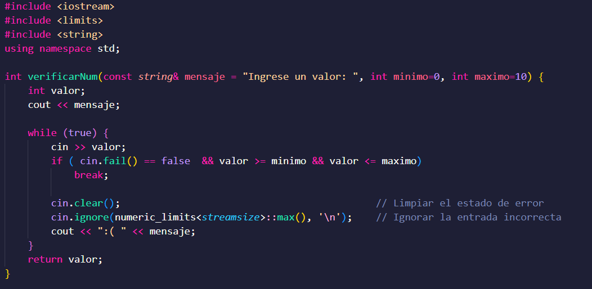

*Lo nuevo*: el **&** despues de *string* indica que debe haber una asignación por defecto a los parametros con los que se trabaja en caso de que al usar la función haya parámetros insuficientes. Esta mecánica en *c++* es conocida como puntero:

- Poner un **"True"** dentro de la condición de bucle hace que este se repita infinitas veces, de tal manera que se vuelva a pedir el valor de la variable al usuario hasta que el ciclo se rompa. 
- El comando **cin.fail()** devuelve un valor booleano ("*true* o *false*") de acuerdo a si la variable se ha guardado y escaneado exitosamente; en este caso, si la variable se guarda correctamente (*cin.fail()* da falso) y se cumple con los rangos del número especificado se rompe el bucle mediante la palabra reservada **break** y se procede a devolver dicho valor. 
- Si el bucle se repite, necesariamente de debe hacer uso de **cin.clear()** y **cin.ignore()** para limpiar y encerar la variable de nuevo, para que vuelva a ser escaneada. *En pocas palabras, el bucle se repite infinitamente ante una tautología*.

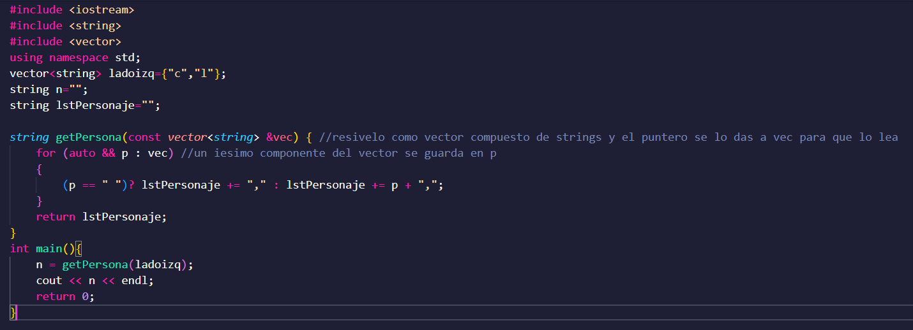

- En este caso el **&** indica también que para el dato recibido no se creará otro espacio de memoria, sino que se le dará un puntero a la variable en el que se "guardará" para que esta pueda leer la info asignada en una dirección específica de memoria; *digase que el puntero es un papelito con la dirección de donde encontrar la info necesaria*.

- El **(auto && p :)** puede usarse como un argumento para bucle, en este caso hace que en cada instancia de dicho bucle a la variable p se le de un puntero para escanear cada miembro individual del vector de strings recibido.  

 
#### Programación del acertijo por partes

**Declaaración de Variables**: Declararemos las variables que necesitamos de forma global, fuera de cualquier bloque del archivo *.cpp* (serán válidas para todo ese archivo *.cpp*):

        #include <iostream>
        #include <windows>
        #include <string>
        using namespace std;
        bool objEstIzq= true;
        string ladoIzq= "O,L,C,U",
        ladoDer= "' ',' ',' ',' '";
        int riolong=20;

**Actualización de Ambos lados**:

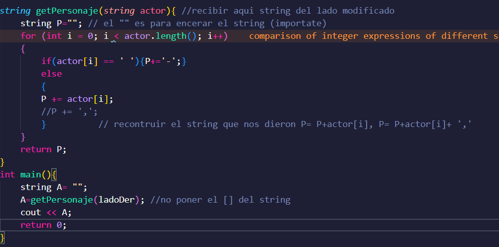

**Animación del Bote moviendose**:

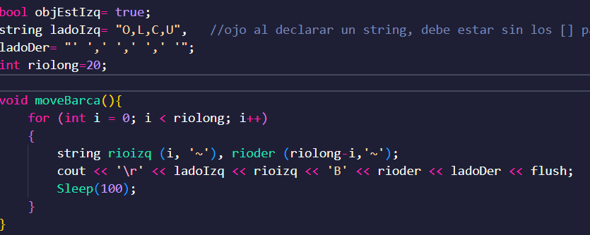

**Menu de Selección de los Personajes**

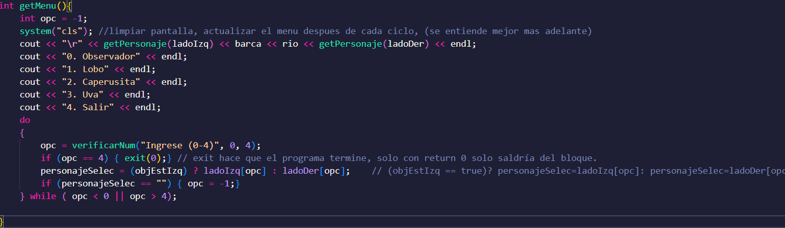

- Mostramos en consola los personajes de cada orilla, el rio y la barca, seguido de las opciones con sus respectivos npumeros, existe un bucle que se mantiene si la opción proporcionada por el usuario está por fuera de los rangos que requiere el programa, ademas se utiliza la función que permite validar que se haya metido un entero.

- Se tienen tres condicionales, el primero checa si se ha ingresado un 4 (salir) para finalizar la ejecución del programa, el segundo revisa si la opción seleccionada corresponde a un personaje a la izquierda o derecha del rio y dependiendo de eso la variable personaje seleccionado es asignada a la poscición donde su personaje se encuentre (derecha o izquierda). Y por último, si el personaje seleecionado se le es asignado a un caracter vacio, el programa le asigna un valor fuera del rango del condicional condelandolo a repetirse.

**getBarca()**: Este bloque de código se dedicará a incluir las animaciones de movimiento de la barca, mientras que tambien desempeñará la lógica de cambio de lado por cada personaje.

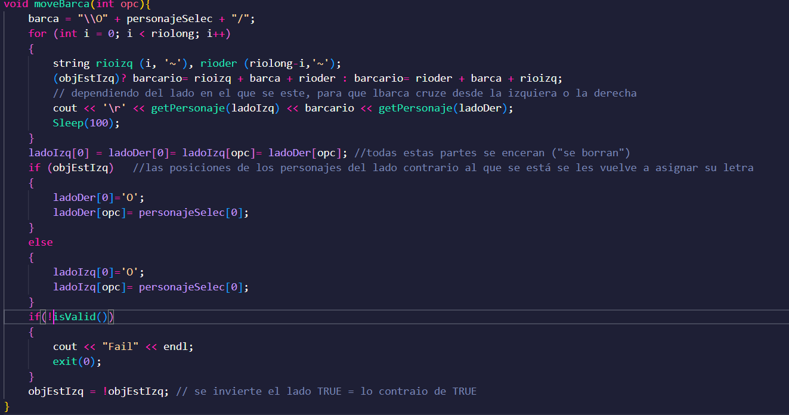

- Para animar al barco de ida y de vuelta se recurre a usar un condicional en base al lado en el que el juego se encuentre, si se está a la izquierda el string de la barca ha de ser concatenado en medio del los carácteres del rio de la izquierda y la derecha o viceversa si está del otro lado.
- Para hacer el cambio de personaje se procee a "*borrar*" (**encerar**) la parte de los arreglos en donde se encuentre el observador y el personaje seleccionado, de nuevo se tiene un condicional que basado en el lado en el que se encuentre el observador asigne en esa posición pero en el lado contrario al observador y al personaje seleccionado.
- Por último se llama al método **isValid** y se cambia al juego de lado, en pocas palabras, el valor de true que indicaba el lado se convierte en false.

**isValid()**: En base al lado en el que se encuentra el juego, los condicionales revisan si en el lado contrario al observador la posición de la caperusa y lobo o la de la caperusa y las uvas se encuentran solas (vacias), en base a si se cumplen o no esas reglas del juego se devuelve el valor de "*true*" o "*false*",

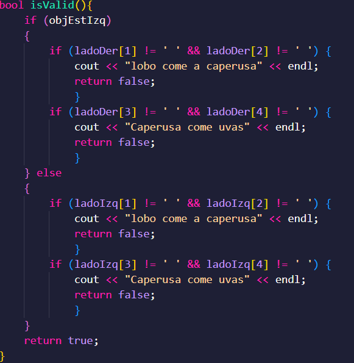

**main()**: El bloque principal tendrá un bucle que se repite infinitamente con una tautología a partir del valor que devuelva la función **getMenu()**.

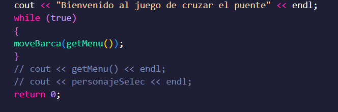

## Manejo de las librerías **vector**, **string** y **fstream**

### Vectores de strings, strings y carácteres.

Anteriormente pudimos ver que gracias a la librería **string** podíamos guardar varios carácteres en un "arreglo" sin la limitación de indicar tamaños, aunque el uso de este tipo de datos puede traer confusión en conparación a los *arrays* tradicionales que se usaban antes en C, y es que se debe tener cuidado al momento de manejar los punteros e indexación de los strings para evitar errores de compilación.

Antes de comenzar a usar datos de tipo **string** deberíamos entender por completo algo de la *syntaxis* asociada a estos arreglos especiales en C++:

- Para representar un caracter se utiliza **'v'**
- Para representar un string se utiliza **" "**
- Un conjunto de varios carácteres forma un string **" ' ' ' ' "**, lo que significa que de un *string* puedes extraer carácteres o que si piensas modificar una componente en específico el dato que debes de ingresar deber ser un *char* (*''*).
- Puedes crear un vector que se componga de strings mediante las librerías *vector* y *string* tal que: *{" "," "}*. De un vector compuesto de strings puedes extraer strings de dicho vector y si piensas modificar una componente debes ingresar un dato de tipo *string* (*" "*)
- Por último, puedes crear vectores de vectores de strings, de tal manera que puedes manejar matrices en las que cada componente individual corresponde a un *string* (*" "*).

        #include <vector>
        #include <string>
        using namespace std;

        string palabra = "hola";
        char primeraLetra = palabra[0]; // 'h'
        palabra[1] = 'o';               // modifica la segunda letra

        vector<string> nombres = {"Ana", "Luis", "Juan"};

        string persona = nombres[0];     // "Ana"
        nombres[1] = "Carlos";           // cambia "Luis" por "Carlos"

        vector<vector<string>> tablero = {
        {"A1", "B1"},
        {"A2", "B2"}
        };

#### Recorrer un vector de strings o un vector de vector de strings

Se puede utilizar los siguientes bucles para vectores compuestos de strings:

        void nombreMetodo(const vector<string> &vector){
            for(auto && variable : vector) //El bucle se ajusta al tamaño del vector para recorrerlo
            {
                (variable.empty())? cout << "[]" << endl : cout << variable << endl; 
            } 
        } //imprimir un vector de strings dado en la consola

        string nombreMetodo(const vector<string> &vector){
            string a="";
            for(auto && variable : vector)
            {
                (variable.empty())? a+= "[]" : a+= variable; 
            }
            return a;
        } //retornar un vector dado (util si este se actualiza en un bucle progresivamente)

Se pueden usar los siguientes bucles para vectores compuestos de vectores de strings:

        void nombreMetodo(const vector <vector<string>> &vector){
            for(auto && variable : vector) //El bucle se ajusta al tamaño del vector para recorrerlo
            {
                for(auto && variable2 : variable) //Bucle anidado
                (variable2.empty())? cout << "[]" << endl : cout << variable2 << endl; 
            } 
        } //imprimir un vector de strings dado en la consola

        string nombreMetodo(const vector <vector<string>> &vector){
            string a="";
            for(auto && variable : vector) //El bucle se ajusta al tamaño del vector para recorrerlo
            {
                for(auto && variable2 : variable) //Bucle anidado
                (variable2.empty())? a+= "[]" : a+= variable2; 
            }
            return a;
        }

### fstream

Es una librería destinado al manejo de un flujo para la lectura y escritura de archivos. Osea que se pueden leer y escribir archivos de texto. Podemos utilizar el siguiente código para:

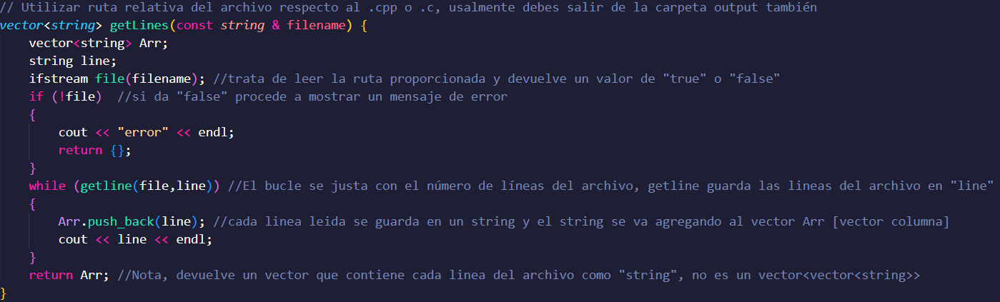

- La palabra clave ifstream puede designar una acción (**file** en este caso) que podemos nombrar de manera personalizada y que actuara sobre un string que ha de llevar la ruta relativa de un archivo para abrir dicho archivo
- La acción **getline(file,variable)** escanea la primera linea del archivo y lo guarda en una en la variable *line* en este caso.
- Aprovechamos la acción de un bucle, en este caso al poner getline en su argumento hacemos que este se ajuste al numero de líneas del archivo.
- Nos valemos de la instrucción **variable.push_back(lo que se quiera guardar)** para guardar cada linea *string* en el vector de strings *Arr* 

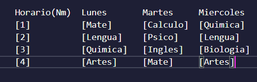

Pero ¿Qué hay de esta tabla? Solo quiero extraer aquellos valores importantes, ahora que lo piensas, no es solo por estética que utilizo los corchetes:

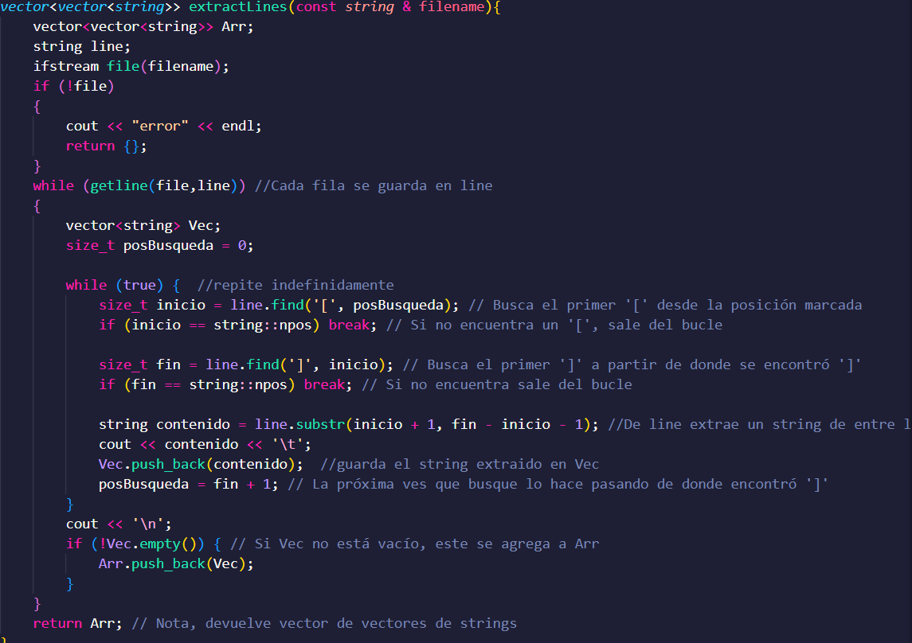

Esta vez el código es más complejo, pero a grandes rasgos puedo decir que busca extraer la tabla, delimitada por los datos en corchetes, y devolverla en una variable de la forma de un arreglo de vectores de strings. Podrás notar que se arma la tabla de manera jerárquica: primero strings, luego la filas y por último se agrega al mega-Arreglo de vectores de strings.

*Dato curioso: Aqui se utilizan de nuevo esos bucles anidados que usabamos al principio para imprimir matrices y gráficos en la consola, sobre todo al momento de imprimir los datos que vayas "importando", eso debería ser util ya que C++ no proporciona una menra gráfica de ver tus Arrays*.

### ctype.h

Hermosa Librería, te permite utilizar "*instrucciones*" como:
| Función       | ¿Qué hace?                                                     | Ejemplo                |
| ------------- | -------------------------------------------------------------- | ---------------------- |
| `isdigit(c)`  | Devuelve `true` si `c` es un dígito (`0–9`)                    | `isdigit('3') → true`  |
| `isalpha(c)`  | Devuelve `true` si `c` es una letra (`a–z` o `A–Z`)            | `isalpha('a') → true`  |
| `isalnum(c)`  | Devuelve `true` si `c` es una letra o número                   | `isalnum('9') → true`  |
| `isupper(c)`  | Devuelve `true` si `c` es una mayúscula                        | `isupper('A') → true`  |
| `islower(c)`  | Devuelve `true` si `c` es una minúscula                        | `islower('g') → true`  |
| `isspace(c)`  | Devuelve `true` si `c` es espacio, tab, salto de línea, etc.   | `isspace(' ') → true`  |
| `ispunct(c)`  | Devuelve `true` si `c` es signo de puntuación                  | `ispunct('.') → true`  |
| `isxdigit(c)` | Devuelve `true` si `c` es un dígito hexadecimal (`0–9`, `A–F`) | `isxdigit('F') → true` |
| `iscntrl(c)`  | Devuelve `true` si `c` es un carácter de control (ej. `\n`)    | `iscntrl('\n') → true` |
| `isprint(c)`  | Devuelve `true` si `c` es imprimible (excepto control)         | `isprint('A') → true`  |
| `isgraph(c)`  | Igual que `isprint()`, pero excluye el espacio                 | `isgraph('#') → true`  |

Útiles para contar letras o números de un texto.

## Recurcividad

        #inlcude <iostream>
        using namespace std;
        int factorial(int f)
        {
        if ( f==1)
            return f;
        return (f *factorial(f-1);)
        }

Piesa un momento, ¿Qué tiene de diferente este método?

El método que viste anteriormente es un bloque dedicado a calcular el factorial de un número dado, el factorial como operación matemática consta de multiplicar un número dado por su antecesor hasta llegar al uno.

Para poder caluclar un factorial usalmente se usa un método recursivo. En el código mostrado anteriormente, la función se llama a si misma cuántas veces sean necesarias hasta llegar al 1. 

Podemos usar la recursividad para hacer una cuenta regresiva de un número hasta el 1, por ejemplo:

    int contadorDesc(int n){
    if (n == 1) return n; //condición para parar
    cout << n << '\t';
    return contadorDesc(n-1) //volver ejecutar el método con el número dado -1
    }

Para desarrollar un método recursivo debemos tener en cuenta lo siguiente:

- Una condición de parada, es decir, un punto en el que el método ya no se llame a si; en este caso es el condicional quien para la recursividad
- Un llamado a la función dentro de la función, pero con el parametro del conteo alterandose (*puede sumarse o restarse con algo*).

De cierta manera es como si fuera un bucle alternativo, que me permite trabajar con números muy grandes o muy pequeñps sin tener que preocuparme por el espacio de memoria que ocupan. También podemos usar la recursividad para multiplicar dos cantidades sin usar el producto, ya que dicha operación se puede expresar como una suma recursiva.

                3*6 = 6+6+6 = 18
        //contador    3,2,1  

La cantidad de veces que se suma el 6 corresponde de hecho a la cantidad de veces que se llama la fución respecto a una cuenta regresiva de 3 a 1.

        int producto(int a, int b){
        if (a == 1) return b;
        return b + producto(a-1,b); //tasa de cambio, vuelve a hacer lo mismo
        }

Aqui a es como un rastreador de la cuenta regresiva y b es el número que se suma a si mismo, cada ves que se suma b, a disminuye en 1 y todo el bloque para cuando a llega a 1. De cierta manera es como si fuera un bucle con un *while* en torno a *a == 1*, y de hecho es así como funcionan los Bucles a nivel interno.

        char showStr(string &nombre, int i){ //presentar string en orden inverso
        if(i == 0) return nombre[i];
        cout << nombre[i] << " ";
        return showStr(nombre, i-1); //parametro de cambio
        }
        char showStr2(string &nombre, int i){ //presentar string en orden normal
        if(i== nombre.length()) return nombre[i];
        cout << nombre[i] << " ";  
        return showStr2(nombre, i+1); //parametro de cambio
        }

Este es un ejemplo de dos bloques destinados a recibir un string e imprimirlos en la consola ya sea de manera normal o de manera inversa, como se menciona antes, al inicio del bucle se pone un condicional destinado a parar la recurción. Para el bucle que imprime el string de mi nombre al reves, a este le combiene iniciar el contador i en la poscición final de mi nombre y paralo cuando este contador especial llegue a 0, mientras que en mi segundo bloque , a este le conviene iniciar el contador en la posición 0 de mi nombre y pararlo cuando llega a su poscición final.

Como en un bucle, todo lo que haga está condicionado por un contador y este contador encuentra su manera de variar cuando se llama a la función.

Creo que la forma más intuitiva de entender la recursividad es verla como una *matriosca*: como un b + (b + ( b + (b + (b + (...))))), hasta que eventualmente se choca con una condición que lo hace pararse, en ese momento los () toman un valor a partir del cuál operar y dicho resultado se ha de devolver en el condicional de parada, entre medias podemos aprovechar para repetir ciertos comando un número determinado de veces.

En resumen:

        metodo_recursivo(){
        if (condicion_de_parada) return valor_objetivo;
        //Poner comando a repetir
        return metodo_recursivo();
        }

## Estruras (custom)

Las estructuras van a referir a la creación de tipos persolalizados de datos dentro de c, por ejemplo:

        struct estudiante
        {
            string nombre;
            int edad;
        }

        struct Mascota
        {
            string nombre;
            int edad;
        }

        Mascota m = new.Mascota;
        m.nombre = "string";
        m.edad = 10;

Nótese que mascota solo es el nombre del tipo de dato o estructura que yo creé y m es la variable que voy a usar para almacenar el valor de la estructura. Por lo tanto, si quiero accder al valor de las variables dentro de mi estructura utilizaré el nombre de la estructura seguido del nombre de la variable que quiero acceder y separadas por un punto.

## Guardar una estructura en un archivo Binario

Hay un problema al guardar estructuras en archivos de texto, y es que si guardo algún tipo de dato referente a un número, este se convertirá en caracter o string y si lo vuelvo a escanear este pasará al sistema como string y no como número, por lo tanto, si quiero guardar un número en un archivo de texto, necesito un archivo de tipo binario.

Aunque, inclusive si usamos un archivo de tipo binario, pueden haber problemas al trabajar con strings ya que su longitud puede variar y no podemos saber cuánto espacio ocupan en memoria, por lo tanto, a veces es mejor solo trabajar solo con arreglos de  tipo char.

Antes ver como crear un archivo binario, primero practiquemos un poco el concepto de estructuras personalizadas:

        struct Mascota
        {
            string nombre;
            int edad;
        }
        struct estudiante
        {
            int id;                  
            int edad;    
            char nombre[20];    
            Mascota mascotita;   //Puedo anidar una estructura dentro de otra, en este caso mascota dentro de estudiante
        };

Para llenar las variables de una estructura:

        estudiante a1 = {1, 10, "Juan", {5, "Firulais"}}; 

        //manera de llenar la estructura estudiante, se queman valores 
        //se llena en orden de acuerdo a los aspectos definidos de la estructura

En este caso concreto para llenar la variable a1 de tipo *estudiante* lo hago como si fuera un arreglo (con un corchete y separando con una coma sus miembros), nótese que cada miembro a llenar coincide con el orden en el qué declaré las mini variables de la estructura de tal manera que el 1 es la id, 10 la edad, "Juan" el nombre y mascotita la variable de tipo mascota, a la que también se le asignarán sus valores de la misma manera. Solo ten en cuenta la estructura de llaves entre las llaves de la estructura que la contiene.

Tambien se tiene una manera algo más dinámica de llenar los espacios declarados de una estructura, util en caso de estar trabajando con estructuras cuyos valores internos sean desconocidos o se vayan actualizando de acuerdo al flujo del programa:

        estudiante a0;              //Manera alternativa de llenar la estructura
        a0.id      = 0 ;
        a0.edad    = 21 ; 
        a0.nombre[0]  = 'Ana';      //arreglo[0] = 'caracteres_que_contenga'
        a0.mascotita.edad = 1;
        a0.mascotita.nombre = "Firulais"; 

        estudiante a2 = {2,20,"Pablo"}; //Pablo esta vez no tiene mascota 

Solo tendría que poner la variable seguida de un punto el "*aspecto*" o "*valor*" (*tipos de datos internos de la estructura*) que yo quiera asignarle o cambiarle, también podras observar que para acceder a la estructura interna de tipo mascota, solo tengo que poner puntos hasta accder al nivel de sus datos (*piensa en ello como si tuvieras que navegar por un directorio de lleno de carpetas dentro. de otras carpetas hasta llegar al archivo que necesitas modificar*).

        estudiante Lst[]= //Puedo crear un arreglo con las estructuras que creamos
            { 
            a0,
            a1,
            {2,20,"Pablo"},
            a3,
            };

Tambien puedes hacer un arreglo de con datos del tipo de la estructura que se crearon antes como se muestra en la figura. Donde:

- *a0*, *a1*, *a2* y *a3* son variables de tipo *estudiante*
- *a2* está declarado de una manera diferente a los demás, pues tiene sus valores quemados.

Como en un arreglo normal, puedes acceder a estas variables mediante la indexación del arreglo, de tal manera que podrías hacer algo como:

        cout << Lst[2].id      ;                                       
        cout << Lst[2].edad     ;                  
        cout << Lst[2].nombre[0];                     
        cout << Lst[2].mascotita.edad;             
        cout << Lst[2].mascotita.nombre;
Para imprimir cada variable dentro de la estructura indexada.

### Guardar una estructura en un .csv

Para este tipo de procesos nos aseguramos primero de importar la librería **fstream**, la cual tiene funcionalidades importantes para poder crear, escribir o leer archivos.

        void saveStruc(const string & filename) {
            ofstream archivo(filename); 
            if (!archivo) 
            { 
                cout << "No se pudo abrir el archivo para escritura." << endl;
                return;
            }
            for (auto && A: Lista)
            {
                archivo << "[" << A.id << "] " << "[" << A.edad << "] " << "[" << A.nombre << "] " << "[" << A.mascotita.edad << "] " << "  [" <<     A.mascotita.nombre << "] " << "[" << A.mascotita.tipo << "] " << endl;
                cout << "[" << A.id << "] " << "[" << A.edad << "] " << "[" << A.nombre << "] " << "[" << A.mascotita.edad << "] " << "["   << A. mascotita.nombre << "] " << "[" << A.mascotita.tipo << "] " << endl;    
            }
            archivo.close();
        }

Como habíamos visto antes, hemos de utilizar el comando **ofstream** para poder abrir el archivo y poder escribir en él, no olvidemos tambien que hemos de recordar que *archivo*, en este caso, es una palabra clave cualquiera que me permite manipular al arhcivo "regido ppor *filename*".

En la imagen el bloque fue programado para recibir un arreglo de estructuras como parámetro, por lo que tiene primero un "bucle autómatico" para recorrer cada elemento del arreglo y poder escribirlo en el archivo, aunque si lo que se quiere es imprimir una estrcutura dentro del archivo tambien se puede hacerlo sin el bucle.

El bloque de código también funciona con cualquier otra cosa que se quiera imprimir en el archivo, solo tienes que asegurarte que la palabra clave que designaste para crear y abrir el archivo, sea la misma que usas envés de *cout* y también sea la misma que usas para cerrar dicho archivo.

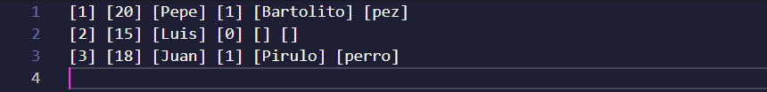

Para hacer el proceso contrario a partir de esta tabla podemos utilizar la misma instrucción enunciada en la sección de **fstream** más arriba. En este caso, se busca extraer un arreglo de vectores de la tabla y recorrer dicho arreglo hasta acceder a los *strings* que contiene para asignarlos a los componentes de la estructura. Ten en cuenta también que cada linea puede corresponder a una estructura diferente, por lo que no sería mala idea hacer uso también de un vector de estructuras:

        vector<estudiante> loadStruc(){
        vector<vector<string>> datos;
        estudiante b1; //estructura temporal
        vector<estudiante> Lista_2;
        datos = extractLines("../estructuras.csv"); 
        for (auto && fila: datos)
        {
            int i=0;
            for (auto && str : fila)
            {
            switch (i)
            {
            case 0:
                b1.id = stoi(str);
                break;
            case 1:
                b1.edad = stoi(str);
                break;
            case 2:
                b1.nombre = str;
                break;
            case 3:
                b1.mascotita.edad = stoi(str);
                break;
            case 4:
                b1.mascotita.nombre = str;
                break;
            case 5:
                b1.mascotita.tipo = str;
                break;
            default:
                cout << "error de algun tipo XD" << endl; 
                break;
            }
                i++;
            }
            Lista_2.push_back(b1); //push_back() significa: ve guardando lo que esta en parentesis en el vector
            }
            return Lista_2;
        }

En este bloque de código utilicé un contador en base a *i* , asociado a cada columna, y un switch (*condicional para varias condiciones*) para que se sepa que parte interna de la estructura temporal debe modificarse. Al termiar el condicional perteneciente a los *str* de la tabla, todo lo que tenga la estructura temporal se integra dentro del vector de estudiantes y el ciclo se vuelve a repetir.

Otro aspecto a destacar es que en cada instancia del bucle cada aspecto interno de la estructura temporal se reemplaza por un "*nuevo valor*"; pero si alguna parte interna de la estructura tiene un vector, se debería utilizar push back para almacenar los datos dentro de este, solo asegurate que una vez recorridos todos los *str* de la fila debes volver a encerar dichos vectores manualmente ya que si no lo haces el contenido de estos de la instancia anterior se mezcla con el nuevo (*recuerda que la estructura solo está para almacenar temporalmente los datos de una instancia del bucle, despues los reemplaza por los datos de una nueva instancia del mismo*)

## Punteros

Son estructuras que apuntan o refrencian a una sección específica de la memoria ram. Estos pueden actuar al momento de clarar una variable (*reserva un espacio*) y luego al asignarle un valor (*Reemplaza todo lo que tenga el espacio por este nuevo valor*). Si bien los punteros hasta el momento se encuentran de manera implícita en este proceso de ejemplo, tambien los puedo utilizar explicitamente:
        int a;
        int *p; //piensa en él como una flecha que apunta espacios de la ram destinados a almacenar datos de tipo int
        char *c; //piensa en él como una flecha que apunta espacios de la ram destinados a alamacenar datos de tipo char

        *p = &a; // el puntero p apunta a donde se guarda la variable a (busca la cajita donde se guarda 'a')

        p=a; // No es lo mismo que lo anterior, con esta instrucción el contenido de 'p' se llena con el contenido de 'a'

Asi:
        *p = &a  // Es como decir al compilador: cada vez que veas a 'p' asignale la id de la caja de memoria donde se almacena a
         p = a // Es como decir al compilador: cada vez que veas a 'p' asignale el contenido de la variable 'a'.

Podemos pensar en los punteros: "***" y el valor de refrencia "*&*" como una etiqueta que se le pone a una caja de memoria para que el compilador pueda identificarla; a veces es mejor trabajar con la etiqueta de los datos envés de su contenido directamente, gracias  los punteros de pueden obtimizar los procesos de carga de los programas por ejemplo.

Ejemplo de como trabajan los punteros en un programa:
        #include <iostream>
        using namespace std;
        int funcion(int valor) //parametro por "valor"
        {
            valor += 5; // en valor: |__valor__| <--- valor + 5
            return valor;
        }
        void funcion_ref(int *valor) //parametro por "referencia"
        {
            *valor += 5; //en num: |__valor__| <--- valor + 5

            // En este caso, valor le asigno la "Etiqueta" de num", si modifico a valor, modifico a num
            // sin necesidad de crear una copia
        }
        int main(){
            int num = 10; // num: |__10__|
            cout << "Valor de num despues de la funcion por valor: " << num << endl;
            funcion(num); // num se pasa por valor, se crea una copia de num en "valor"
            // Notese que num no se modifica, solo retorna el valor modificado
            cout << "Valor de num despues de la funcion por valor: " << num << endl;
            num = funcion(num);
            cout << "Valor de num despues de asignarle el resultado de la funcion por valor: " << num << endl;

            num = 10;
            cout << "Valor de num antes de la funcion por referencia: " << num << endl;
            funcion_ref(&num); // num se pasa por referencia, se pasa la direccion de memoria de num
            // Notese que num se modifica directamente
            cout << "Valor de num despues de la funcion por referencia: " << num << endl;
            return 0;
        }

        // si a=b ambas comparten el mismo contenido
        // si *a=&b ambas comparten la misma direccion de memoria
        // Para que una valor se dobleimplique con el otro: o

Se que es algo un poco contraintuitivo, en matemáticas por ejemplo aprendemos que si dos variables son iguales , entonces sus valores son iguales y viceversa, pero en programación no es así, en programación si dos variables son iguales, entonces sus valores son iguales, pero si sus valores son iguales, no necesariamente son iguales esas dos vaaribales, es decir, trbajarán por separado y necesaitaré algunas líneas de código para que se comporten como si fueran una sola variable como lo vimos más arriba.

               |varible_1| = |variable 2|
                   |              |
           [int]<--|              |-->[int]   // son dos espacios de memoria diferentes, solo comparten valor

Quizás nos será conveniente pensar en la base de un puntero (*), como una especie de hipervínculo o portal que no ocupa lo mismo que una caja de memoria pero transporta al compilador a una caja de memória específica que será identificada por un (&). 

    *---->&

    *Variable_1 = &Variable_2 // para el compilador, variable_1 solo va a ser el asterisco, pero este asterisco transporta al compilador a la caja de memoria de variable_2

         (*)-----> [__] // en realidad solo hay una caja de memoría

Con esto consigo que las dos varibales se comporten como una sola ahorandome líneas de código y un espacio de memoria.

### Arreglos Dinámicos

Anteriormente aprendimos que los arreglos tienen una longitud fija, pero a veces necesitamos crear un arreglo cuyo tamaño no sabremos todavía o que talvez sea definido por el usuario en alguna entrada, o puede ser que nos toque poner más datos de los que esperábamos en dicho arreglo.

Entonces **¿Como se omporta un puntero en este caso?**, quiero decir , no se va a apuntar a alguna variable en específico , sino que se lo hará directamente a un espacio de memoria donde se almacenarán los datos del arreglo.

Para ello nos vamos aprovechar de la función *new data_type[]* incluida en la biblioteca **iostream**, esta instrucción nos permite reserva un espacio de memoria de acuerdo a su argumento, *new int[3]* reseva tres espacios de memoria de tipo entero. De acuerdo a ello:

*Arreglo unidimensional*

    int *arreglo = new int[n]; // reserva tres espacios de memoria de tipo entero

    Para el compilador: arreglo = *

            (*)----> [int, int, int, ....,int] // lo transporta a un espacio con 'n' cajas de memoria

*Arreglo bidimensional*

Pequeña varicación en la syntaxis: en (new data_type*[]) se coloca el asterisco antes de los corchetes para indicar que no se va areservar espacios para memoria, sino espacios para punteros

    int **arreglo = new int*[m]; // fijate en los asteriscos 

            (*)----> [*, *, *, ..., *] // lo transporta a un espacio con 'm' punteros

Nótese que si se va de un portal a más portales, se debe agregar un asterísco extra por cada nivel que haya de suceder eso, en este caso , un puntero a un puntero a un puntero en solo una instancia.

                    [*, *, *, ..., *]  // Ahora recorramos los espacios con un for
                     0  1  2, ...,m-1    

    for(int i=0; i < m, i++ )
    {
        arreglo[i] = new int[n]; // reserva 'n' espacios de memoria de tipo entero para cada pun
    }

Entonces:

                    (*)
                     |
                     |----->[*]---->[int, int, int, ..., int]
                     |----->[*]---->[int, int, int, ..., int]
                     |----->[*]---->[int, int, int, ..., int]
                     |
                     |...
                     |----->[*]---->[int, int, int, ..., int]

Otro diagrama:

                                         matriz (int**)
                                                |
                                --------------------------------
                                |               |              |
                            matriz[0]        matriz[1]      matriz[2]  ...  matriz[m-1]
                              (int*)           (int*)         (int*)          (int*)
                                |               |               |               
                           [int,int,...]   [int,int,...]   [int,int,...]

*Espera un momoento.... eso se parece a las ramas de un arbol*

Nótese tamnbien que no he utilizado (&) todavía, pues no tengo una varibale en específico a la cual apuntar, solo tengo meros espacios de memorpia; aunque, ¿cómo los lleno?

    // Para un arreglo unidimensional

    int *arreglo = new int[n]
    for(int i=0; i < n; i++)
    {
       arreglo[i] = 0; // o cualquier otro valor.
    }

Si quisiera que el arreglo se llene a lo *enum{}* se pondría i. O podría jugar con más punteros

    int valor = 42;
    int* pValor = &valor;

    int* arreglo = new int[n];
    for (int i = 0; i < n; i++) 
    {
        arreglo[i] = *pValor;  // tobogan de serpiente que conduce a valor (porque ahí marca el (&))
    }

Para llenar un arreglo bidimensional debemos recurrir a los típicos bucles anidados

    for (int i = 0; i < m; i++)
    {
        for (int j = 0; j < n; j++) 
        {
            matriz[i][j] = 0 // o cualquier valor o fórmula que desees.
        }
    }

**¿Que hay de una función o de un void con parametros?**

    void procedimiento(int* nueva_variable)
    {
        nueva_variable = 6;
    }
    int main()
    {
        int valor = 5;
        procedimiento(&valor);
        return 0;
    }

¿Tendrá algo que ver con los *for* de tipo *auto*?

    void procedimiento(int& ref) 
    {
        ref = 10;  // le das la potestar de acceder a valor, aunque necesariamente usas punteros
    }
    int main() 
    {
        int valor = 5;
        procedimiento(valor);
    }

## Colas

En esencia, las colas no son más que un conjunto de estructuras que se entrelazan entre si como si fueran los vagones de un tren o los diferentes eslavones de una cadenas, de ahí que se les relacione con la forma de una cola o fila, aunque este grupo de estructuras no forme necesariamente un arreglo.

Vamos a partir de dos estructuras importantes : la cabeza y la cola y los eslaones de la cadena conocidos como los *nodos*. En la *cola*, se encuentra contenida la información que indican qué estructura va al inicio de la cadena y qué estructura va hacia al fondo de la cadena, mientras que el *nodo* como tal indica los contenidos de cada estructura contenida dentro de la cadena asi como también tiene que enlazar cada *nodo* para formar la cadena.

    struct nodo
    {
        int dato;
        nodo *siguiente;
    }

Lo más curioso de como está configurado el nodo es que el *siguiente* es un puntero que apunta a una estructura de tipo nodo, es como si se fuera a decir que el siguiente elemento de la cadena es un nodo, y así sucesivamente.

    struct cola
    {
        nodo *delante;
        nodo *atras;
    }

Tiene punteros que representan la cabeza y el final de la cola solo con punteros.

A una estructura se le pueden encolar o agregar elementos mediante una función algoritmica de nombre *encolar* o *push*. Lamentablemente C++ no tiene una función que haga aquello de formar directa, por lo quue tendremos que crear un método que lo haga:

    struct nodo
    {
        int dato;
        nodo *siguiente;
    };
    struct cola
    {
        nodo *delante;
        nodo *atras;
    };

    void encolar(cola &q, int valor)
    {
        nodo *aux = new nodo;
        (*aux).dato = valor;
        (*aux).siguiente = nullptr;
        if (q.delante == nullptr)
            q.delante = aux;
        else
            (*q.atras).siguiente = aux;
        q.atras = aux;
    }
    int main(){ 
        cola q;
        q.delante = nullptr;
        q.atras = nullptr;
        encolar(q,1);
        return 0;
    }

Lo que se ha hecho es utilizar un void que se encarga de recibir el nombre del puntero que vaya a referenciar a la cola y los datos que han de ser guardados en cada nodo de la cola. Nótese que cuando se crearon los nodos se los hizo apuntar a un valor nulo, esta es un buena práctica de programación para evitar problemas de memoria para "encerar el puntero en cuestión".

Primero se crea un puntero auxiliar que apunta a un espacio de memoria reservado para una estrucutra de tipo nodo en la cual se van a guardar los datos de la cola, ahora ¿por qué es solo un espacio de memoria reservado? ¿No pude haber creado un nodo directamente (variable)? Lo cierto que si se hubiera hecho así, el nodo tendría que tener otro espacio de memoria dentro de su espacio de memoria para poder almacenar el puntero que apunta a la siguiente estructura de tipo nodo y entonces la optimización del programa se vería comprometida, por lo que es mejor aprovecharse de las ventajas que ofrecen los punteros para poder hacerlo de manera más eficiente.

Otro aspecto a destacar es que aux se ha creado en forma de puntero, por lo que se debe hacer un pequeño cambio de sintaxis para acceder a las variables de la estructura de tipo nodo:

    (*struct).dato = valor; 
    struct -> dato = valor;

Cualquiera de las dos formas son válidas para expresar que se están modificando las variables de una estructura que se ha creado en forma de puntero.

Volviendo al funcionamiento del algoritmo, se hace que el puntero siguiente, guardado como una estructura de tipo nodo, apunte a un valor nulo para "encerarlo", el condicional if verifica si ya existe una cabeza para la cola:

- **En caso de que si:** El contenido del auxiliar (que ya apuntaba a la memoria reservada para la estructura) queda enlazado con la cabeza,
- **En caso contrario:** El puntero "**siguiente*" de la cola asignada se enlazará o apuntara al nuevo nodo (a todo el nodo) que ha sido creado en la memoria reservada.
- **Al final:** El puntero que indica la cola apuntará o se enlaza con el nodo creado en la memoria reservada.

En el caso de la primera interación, el puntero siguiente no apuntará a nada pues se le asigna un valor de null, y el nodo enlazado en cuestión actuaria de cabeza de la cola al mismo tiempo hasta introducirse otro elemento en la cola.
En resumen:

- Se crea un espacio.
- Se lo llena.
- Una parte del nodo anterior se dedicará a apuntar al nodo actual.
- El nodo actual se convertirá en el nodo anterior de la siguiente interación.
- Los nodos no son guardados en ninguna variable sino que se acceden a sus espacios de memoria por medio de punteros.
- Las partes de los nodos que apuntan a otros nodos son datos del mismo tipo de estructura pero están configurados como punteros, lo que evita que se produzca una matriosca mortal.

