# Programación I

>16 de abril de 2025, clase 01 de Programación I

## ¿Qué es un IDE?

Un **IDE** es un Entorno de programación estructurad que se compone de:

1. **Lenguaje de Programación**: *(Debe estar instalado en tu pc)*.
2. **Compilador del Lenguaje a utilizar**: *Un programa que se encargará de ejecutar el código oque tu escribirás*.
3. **Editor de texto**: *Donde tu escribirás tu código*, es recomendable utilizar Visual studio code junto con sus extensiones para tener una mejor experiencia.
4. **Terminal de mi Lenguaje**: *Una ventana en la yo pueda ejecutar los comandos relacionados al lenguaje que voy a trabajar*.
5. **Git-Bash**: *Una herramienta para integrar tu proyecto en la red*.

## Algunos comandos clave para el terminal

>21 de abril de 2025, clase 02 de Programación I

### Algunos atajos de teclado para el Visual code

- *F1 o CTRL+ SHIFT+ P*: abre una barra de busqueda de comandos relacionados a las extenciones del visual, **ejemplo**: Abrir un preview o generar un pdf.
- *CTRL+ B*: Esconde la barra lateral que muestra a los archivos y/o workspaces abiertos.
- *AlT+ up,down,left,right*: me permite mover las líneas de mi código.
- *SHIFT+ ALT+ A*: me permite generar una multilinea.
- *CTRL+ SPACE*: activar sugerencias (para tomarlas usar **TAB**).
- *SHIFT+ ALT+ UP/DOWN*: copiar una línea de código.
- *CTRL+ P*: abrir rápidamente un proyecto.
- *CTRL+ D*: cursor múltiple.
- *CTRL+ T*: buscar símbolo o palabra que que hayas seleccionado.
- *CRTL+ K+ C*: el código que selecciones se convertirá en comentario
- *CTRL+ K+ U*: las líneas de comentarios seleccionadas dejarán de ser comentario.

### Comandos para el CMD o Powershell (win y Linux)

- **pdw**: muestra a que directorio está asociada la terminal
- **ls**: muestra los archivos de un directorio.
- **..\directorio\archivo**: navegar por un directorio.
- **cd..**: la terminal se mueve un directorio más arriba.
- **touch *archivo.extensión*** , o en su defecto **touch directorio/*archivo.extensión*** para crear archivos.
- **ls** o **cat** o **code** ***archivo.extensión*** *(si hace falta, poner directorio antes del archivo)* para leer un archivo.
- **mkdir**: crear un directorio o carpeta.
- **rm *archivo.extensión*** *(agregue directorio antes del archivo si es necesario)* para eliminar un archivo.
- **cp *archivo(a copiar).extensión directorio/nombre de la copia.extensión*** para copiar un archivo dado.
- **mv *archivo.extensión* *directorio donde quieras mandarle*/** para mover un archivo de lugar o renombrarlo.
- **ps**: procesos activos
- **ipconfig**: para ver direcciones ip (incluso puedes ver la de tu router).
- **ping **web.com***: analiza la conexión con un sitio web.
- **echo "hola mundo">>*archivo.extensión***: inprime un mensaje en un arhivo dado.

### Algunos Comandos exclusivos del GIT

Nótese que siempre empiezan con "git"

-**git config --global -h**: ayuda para configurar cosas del GIT

- **git config --global user.name** / **email** para consultar con que credenciales el equipo esta registrado en la red del GIT. agregar *"usuario / email que quieras configurar"* despues del comando de arriba para configurar usuario y email.

Ojo! Debes configurar usuario y email para poder subir tu proyecto a la nube

- **git init**: iniciar el monitoreo de GIT (puntos de control) en el workspace en el que estás.
- **git add *archivo.extensión***: agregar un archivo al monitoreo de GIT.
    **git add .** agregará todos los archivos de un directorio al trakeo de GIT.
- **git status**: reporte de la situación por parte de GIT (lo que se modificó o sincronizó).
- **git commit -m *"mensaje"***: sincronizar cambios detectados por el GIT en los documentos que monitorea.
- **git++ *archivo.cpp -o ejecutable.exe***: para compilar un archivo de código de C.
- **directorio/archivo.exe**: para ejecutar un archivo .exe desde la consola.

>22 de abril de 2025, clase 03 de Programación

### GIT para la nube

- *git push*: para subir tu proyecto a un repositorio en la nube.
- *git pull*: para descargar código de un repositorio de la nube.
- *git clone URL.com*: para clonar un repositorio de la web.  

### Algunas carpetas importantes en tu Workspace

- **Bin**: binaries, los .exe generados despues de copilar código.
- **Lib**: librerías o bibliotecas a utilizar en el desarrollo.
- **Src**: donde se alojará el código base del proyecto
- **Database**: donde se encontrarán todos los archivos relacionados a los datos.
- **Tmp**: archivos temporales o auxiliares, puede alojar un archivo *gitignore*
- Si:  
    *touch  directorio/.gitignore*

    *echo "<*>.formato">>.gitignore*

     Imprimiré un parametro en *gitignore* para hacer que git no trakee a los archivos de cierto formto, esto es util con archivos .exe,.pdf,.htlm, ya que se generan cada que se compile un código.

📁 mi-proyecto/

├── 🔐 .env

├── ⚙️ bin/

│   └── 📜 setup.sh

├── 📚 lib/

│   └── 🧰 utils.js

├── 🗄️ database/

│   ├── 📄 schema.sql

│   └── 📄 seed_data.sql

├── 💻 src/

│   ├── 🧠 main.js

│   └── 📂 controllers/

│       └── 👤 userController.js

├── 🧹 temp/

│   └── 📁 cache/

└── 📘 README.md

## Branchs de GIT en tu Proyecto

Los diferentes puntos de control que crea GIT en tu proyecto se alojan a lo largo de una rama principal (tienen un id y hash asociados), aunque puedes crear más ramas paralelas que estrán dedicadas a desarrollar diferentes partes del proyecto. Toma en cuenta que al final del desarrollo las ramas se tendrán que unir de nuevo a la principal mediante una función "merge".

```
🌳 main
│
├── 🟢 ●Commit I
│
├── 🟢 ●Commit II
│
├── 🟢 ●Commit III
│     │
│     └── 🌿 feature/A
│          │
│          ├── 🟡 ● Desarrollo feature-A
│          ├── 🟡 ● Commit en freature-A
│          └── 🟡 ● Me muevo a la rama main
│
├── 🔵 ● Merge feature-A 
│
└── 🟢 ● Continuar desarrollo
```

>23 de arbril de 2025, clase 04 de Programación I

### Comandos Importantes para las Branchs de GIT

- *git branch*: muestra todas las ramas creadas
- *git branch -m nombre_nuevo*: renombrar una branch
- *git log*: listado de todos los puntos de control de tu branch

    *git log --graph*: agrega un pequeño dibujo al comando de arriba, recuerda salir del log con *q* (quit).
- **git checkout archivo.formato**: vuelve al último punto de control que haya guardado GIT.

    **git checkout *hash del punto de guardado***: para volver a un punto de control específico.
- **git tag *nombre_custom***: darle un nombre personalizados a tus commits o puntos de control (ver1 ,ver2, ver3, etc).
- *git diff*: reporta los cambios de código dados despues de un commit
- *git reset*:

## C/C++

>28 de abril de 2025, clase 05 de Programación I

### Manejo de Branchs en GIT

Pueden existir tantas branch como funcionalidades tenga el proyecto, algunas se encargarán de resolver problemas específicos como la aparición de errores críticos por medio de un "hotfix".

- **git branch *nombre***: crea y nombra un branch a partir de la rama principal. *la rama será creada a partir del último commit guardado en la rama madre.* 
- **git switch *nombre_rama_objetivo***:cambiar la rama en la que te encuentras por la que indicas en el comando.
- **git merge *rama_externa***: Une los elementos que tenga la rama mencionada (a partir de su último commit) en el comando con los elementos que tenga la rama en la que se encuentere en ese momento.

#### Unificar dos Ramas

Se hace un commit de la rama en la que se este trabajando, para luego cambiarse a la rama principal desde la cual se ha de ejecutar la función *merge*.

El proceso completo de drear una rama nueva, trabajar en ella y luego unir los cambios a la rama principal queda tal que:

    git branch  //poner rama aquí

    git switch //rama a la que cambiarse

    git commit -m "//mensaje del commit"

    git switch main

    git merge //rama con la que quieras unir los cambios

    git branch -d //rama a eleminar
(**opcional**: esta parte borra la rama mencionada en el comando)

>29 de abril de 2025, clase 06 de Programción I

### Integrar código en la nube

Se utiliarán los comandos *git push* y *git pull* para poder guardar tu código en la nube, tener en cuenta que los cambios realizados localmente se sincronizarán localmente con la nube una vez sean subidos a la nube.

Nótese que se necesita algún método de autentificación para poder utilizarse los comandos *pull* y *push*, uno de los métodos más comunes es generar dos llaves *ssh*: pública (para la nube) y otra privada (para el équipo).

Para crear las llaves *ssh*, primero se debe crear un directorio *.ssh* (oculto):

    cd ~
    pwd: */c/users/tu_usuario*
    mkdir .ssh
    cd .ssh
    pwd: */c/users/tu_usuario/.ssh*

Creación de la llave *ssh*:

    ssh-keygen -t ed25519 -C "github_email"  
    
    *ingresar directorio y archivo para la key*

El comando te avisara cuáles serán tus claves privadas y públicas.

Ahora solo queda inciar el *ssh agent* 

    eval "$(ssh-agent -s)"

para agregar tu *key* personal al equipo:

    ssh-add ~/.ssh/*nombre_de_tu_key_privada*

Y por último tienes que agregar tu *key* pública a tu cuenta de github.

Ahora solo tienes que iniciar tu nube con: *git remote add origin git@github.com:user/repositorio.git*
ojo!!! debes crear tu repositorio en GITHUB primero.

    git remote add origin git@github.com:user/repositorio.git

No olvides comprobar la conexión con la nube con: *ssh -T git@github.com*, si dice que estas correctamente autenticado estas del otro lado!!

    ssh -T git@github.com

Para tu primer push has de usar: **git push -u origin *branch***

>4 de abril de 2025, clase 07 de Programación I

## Programación orientada a objetos

Cuando se requiere solucionar un problema por medio de la programación, irónicamente programar es lo último que se hará en dicho proceso; Para solucionar un problema de cualquier tipo se seguirá el siguiente procedimiento:

1. Encontrar un patrón.
2. Hacer un algoritmo
3. Convertir algoritmo en código.

En otras palabras, programar implica trabajar con *algoritmia* antes de siquiera programar; por ejemplo, si quisiera hacer un programa para calcular el área de un cuadrilatero dado, sería buena idea representar su solución por medio de un algoritmo y pseudocódigo plasmados en un diagrama de flujo.

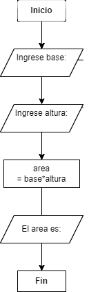

Dentro de la programación estructurada se trabajarán con espacios de memoria llamados *bloques*, algunos de estos bloques estrán destinados a procedimientos especiales (*Void*) y otros a guardar variables para luego regresar un resultado, estos dos tipos de bloque trabajarán con otro bloque llamado *main*.

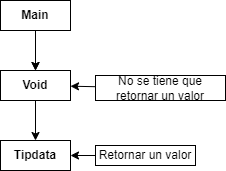

Para empezar a programar:

Se necesita incluir la biblioteca que alamacena las funciones básicas a utilizar, llamar al bloque main ya sea por medio de void o un *tipo de dato* y en caso de usar algun tipo de dato se debe retornar un valor que concuerde con dicho tipo de dato al final del código; 
todo esto se hace con la finalidad de que el compilador sepa como leer el código que escribimos (*empieza a leer al identificar a main*).

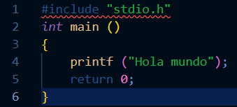

## C/C++

Este lenguaje es medio rarito y un tanto elemental, por lo que muchos de sus procesos resultarán algo más tediosos comparados con otros lenguajes con syntaxis más simples; por ejemplo, en python o mathlab no se tienen que especificar un tipo de dato cuando se requiere declarar una variable, en C o C++ si, y hablando de tipos de datos/variables...

### Tipos de datos

En una variable podrás guardar diferentes tipos de variables tales como:

- **int**: números enteros.
- **float**: números decimales.
- **double**:  decimales que requieren mayor precisión (3.1416...,*e*).
- **bool**: variables de tipo booleano (*true*,*false*).
- **char**: caracter individual (*A*).

Estos son los tipos de datos más básicos que pueden haber en C/C++, desde luego hay más tipos de datos pero derivados de los anteriores.

### Problemas Básicos

#### Ejercicio 1

Haga un programa que pueda calcular el área y perimetro de un rectangulo en base a los datos proporcionados por el usuario.

-Recordamos el algoritmo que representamos más arriba, para el cual necesitamos *imprimir* un mensaje al usuario y utilizar una función *input* para que el usuario pueda introducir los datos del problema, posteriormente se procederá al cálculo y se *imprimirá* el resultado:

De tal forma que se utilizarán las funciones: *printf ("")* y *scanf("%tip_dato",&variable)* contenidas en la libreria: *"stdio.h"*

- Empezamos por llamar a la librería: *#include "stdio.h"*
- Llamamos a main:                    *int main ()*
- Abrimos llaves y declaramos las variables necesarias: *{ float base=0; float altura=0; float area=0;float perimetro=0;* 
- Las variables valdrán 0 en un inicio aunque se les asignará un valor más tarde, no olvides especificar que tipo de dato se guardará en una variable.
- Mostramos los mensajes necesarios: *printf ("ingresa base")*; *printf ("ingresa altura")*; *printf ("el area es")*; *printf ("el perimetro es")*.
- Escribimos los inputs: *scanf ("%f", &base)*; *sacnf ("%f", &altura)*.
- Nótece que la incial al lado del porcentaje corresponde al tipo de dato en el que se quiere guardar el input.
- El cálculo: *area= base x altura*; *perimetro= 2 x (altura+base)*
- Como no usamos un void tenemos que retornar un valor: *return 0;*
- Cerramos llaves: *}*

Realizamos el proceso tal que:

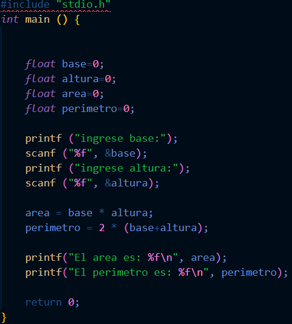

- El \n al final de cada print supone que el texto impreso se salte una linea entre prints.
- Si quiero limitar el número de decimales que se mostrarán en la impresión, puedo utilizar la expresión *.n* despues del "*%*", donde *n* es el número de cifras decimales que quiero mostar en la respuesta

>5 de mayo de 2025, clase 08 de Programación I.

>6 de mayo de 2025, clase 09 de Programación I.

### Refactorizar tu código

Dentro de la programación, el refactorizar es un proceso de mejorar el código existente sin cambiar su comportamiento, de tal manera que nuestro programa sea más facil de entender.

Para entender mejor este concepto partimos de:

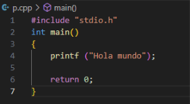 

Podemos extraer la función "*printf*" por medio del atajo *Ctrl + Shift + R* y nombrarla como queramos aunque es preferible que el nombre sea un verbo en infintivo que describa la función al guardar:

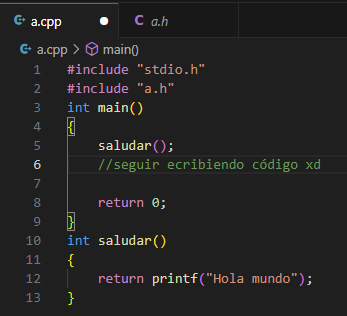

Al hacer este proceso tambien he creado un archivo .c que tendrá el nombre de mi archivo .cpp y que contendrá la función o las funciones que refactorizaré a futuro dentro de mi archivo .cpp, por lo que se tendrá que llamar a esa biblioteca para usar la función guardada.

Nótese que en mi bloque principal la función "*printf*" se convirtió en "*saludar()*" y al terminar el bloque saludar empieza otro bloque que define a que refiere la función "*saludar()*". Con esto se espera resumir un pedazo de código recurrente bajo un "*nombre clave*" a costa de tener que definir que significa ese nombre clave dentro del código del proyecto.

-Advertencia: toda variable guardada dentro de una función o procedimiento refactorizado funcionará a nivel local, es decir, solo valdrá dentro de la función o procedimiento "*guardado*". Si quieres guardar una variable de manera global, lo tendras que hacer en el bloque principal.

>07 de mayo de 2025, clase 10 de Programación I

>12 de mayo de 2025 , clase 11 de Programación I

### Arreglos (*Arrays*)

Cuando se habla de *arrays* se refiere a una colección de variables de un mismo tipo de dato que se almacenan en memoria, en pocas palabras, se habla de vectores y matrices que almacenan variables.

Por ejemplo, si quieres guardar la edad de 6 personas en una variable.

La forma de declarar una fila es: *tipo_dato* *nombre* *[i]* = *{0,1,2,....i}* , donde *i* es el número de datos en la fila (debes ingresar los datos dentro de las llaves). Ojo!, los elementos de la fila se enumeran desde 0.

Tal que:

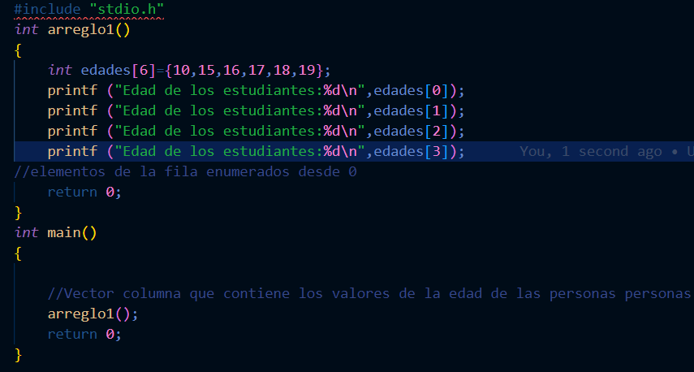

Tambien puedo modificar los valores de los diferentes elementos de la fila de la siguiente manera:
*nombre* *[i]* = *valor_iésima_fila*

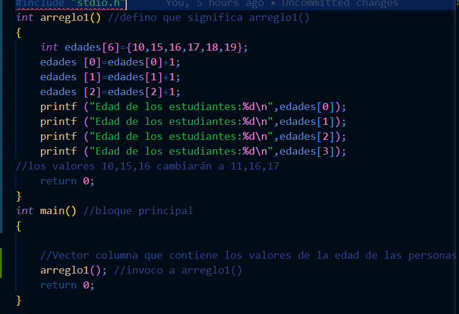

Nótese que toda la fila de datos tiene asignada un nombre de variable (*edades* en este caso) y que tambien puedo referirme a cada elemento de la fila de datos por separado con el nombre del arreglo y su identificador "*[i]*", de tal manera que puedo escribir:

        printf ("%d\n", array[i])
por ejemplo

O puedo tambien utilizar un bucle para imprimir los elementos de la fila de datos:

        for (size_t i = 0; i < 5; i++)
    {
        printf ("ingrese el valor para el elemento\n");
        scanf("%d",&arreglo[i]);
    }
    for (size_t i = 0; i < 5; i++)
    {
        printf("%d\n",arreglo[i]);
    }

y hablando de bucles....

>13 de mayo de 2025, clase 12 de Programación I

### Bucles

La estructura clave para inciar un bucle es:

**for (inicio, condicion, incremento)**

        for (data_type i = 0; i < n; i++)
        {
        //Poner una función
        }

Un bucle es un procedimiento encargado de repetir una serie de instrucciones en cierto intervalo de valores para i; donde i es un número entero en el que se comienza y n en el que el bucle finaliza, lo que lo hace especialmente útil a la hora de trabajar con un arreglo debido a que se requiere trabajar de la manera más abreviada posible con los múltiples elementos que puede tener un fila de datos.

En este caso, el i++ significa que el valor de i aumenta en 1 en cada iteración del bucle de tal manera que i=1+i; aunque tambien puedo asignarle más condiciones a mi bucle, como por ejemplo: i=2+i, y lo podría combinar con un printf para imprimir números pares en consola cuantas veces lo diga *n*.

Un bucle tambien se puede dar mediante las palabras clave *while* y *do while* tal que:

while *condición*
    //alguna instrucción, *incremento*;:

do
{
    //alguna instrucción, *incremento*;:
}
while *condición*: //i<final

**Advertencia:** Es recomendable que los valores de *i* y *n* sean variables, no asignarles valor directamente.

>14 de mayo de 2025, clase 13 de Programación I.

### Series

#### Ejercicios

1. Imprima "*+*" en la consola 6 veces utilizando un bucle.

**Con la primera estructura**

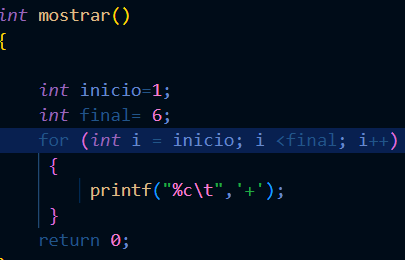

**Con una extuctura alternativa**

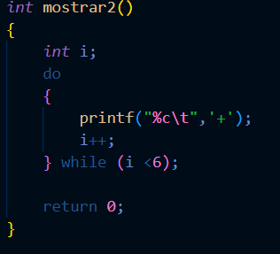

**Resultado:**

➕	➕	➕	➕	➕	➕

2. Haga una serie de 10 elementos que alterne entre "*+*" y "*-*" empezando por "*+*".

Analicemos primero a que número de la serie le corresponde cada caracter:

    1  2  3  4  5 
    +  -  +  -  + 

Podemos notar que si empezamos por "*+*", a cada "*+*" le corresponde el número impar y a cada "*-*" le corresponde el número par, por lo que debemos:

- Definir "*+*" y "*-*" en términos de variables (*char*).
- **Distinguir entre números pares e impares**.- Sabemos que todo número par es divisible para 2, por lo que su residuo al dividirlo entre 2 es 0, y para todo número impar su residuo será diferente de 0, tal que: i %2=0 si es par y i %2=0 si es impar, donde "*%*" indica el residuo de la división entre "*i*" y "*2*".
- **Usar un condicional para alternar entre "*+*" y "*-*"**.- Para iniciar un condicional se utiliza la palabra clave *if* para establecer una condición a cumplir, si se cumple la condición indicar una instrucción y si no se cumple dicha condición indicar otra instrucción mediante la palabra clave *else*.

**Con la primera estructura:**

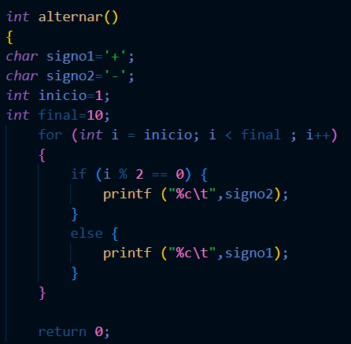

**Con una estructura alternativa:**

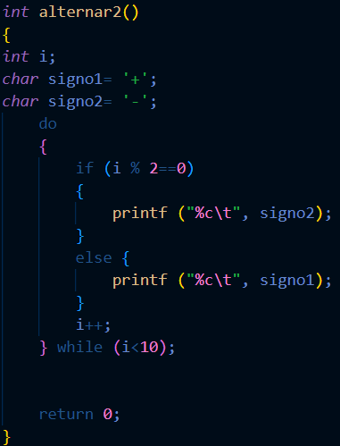    

**Resultado:**

➕	➖	➕	➖	➕	➖	➕	➖	➕ ➖

3. Imprima una serie de Fibonacci en la consola, el número de elementos que tendrá la sucesión será definida por el usuario.

- **Definir la serie de Fibonacci:**- La serie de Fibonacci es una secuencia de números en la que cada número es la suma de los dos números anteriores; podemos empezar definiendo en variables los primeros números de la serie tal que uno sea el sucesivo del otro, en este caso podemos definir un "*a=0*" y un "*b=1*", la idea es que a adquiera el valor de "*b*" y que "*b*" adquiera el valor de "*a+b*", pero este "*a+b*" debe contener los valores "originales de "*a*" y "*b*" antes de que "actualicen" tal que necesitamos definir una variable c que contenga el valor de "*a+b*" antes de actualizar "*a*" y "*b*"; el elemento que se tendrá que imprimir en consola será el valor de "*a*".
- **Introducir instrucción dentro del bucle**.- es necesario introducir nuestra función "*printf ("%d",a)*" dentro de un bucle para que *printf* se repita tantas veces como queramos.
- **Usar un "input" para definir el número de elementos**.- se tendrá que declarar una variable que contenga el valor que el usuario introduzca en la consola y que al mismo tiempo hará de condición en nuestro bucle *(i<n)*.

**Resolución**
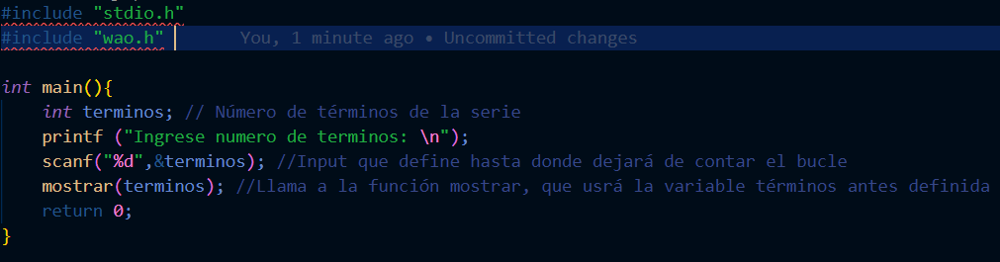

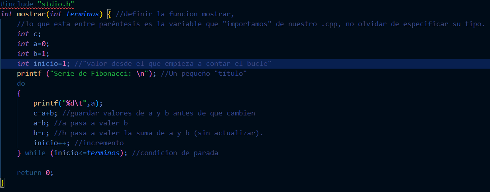

4.- *Anidar bucles*: es la acción de generar un bucle dentro de otro bucle, de tal forma que puedes generar algunas interacciones muy curiosas. Por ejemplo, si quieres imprimir dos caracteres alternados tantas veces como sea el número de elementos de una serie de Fibonacci, puedes hacerlo de la siguiente manera:

- Crear un bucle principal que contenga a la serie de Fibonacci.
- generar otro bucle antes de cerrar el bucle principal que contenga como condición de final a cada número que se imprimirá en la sucesión de Fibonacci. Tal que:

    Fibonacci: 0

    Fibonacci: 1
    -> Repetición 1

    Fibonacci: 1
  -> Repetición 1

    Fibonacci: 2
  -> Repetición 1
  -> Repetición 2

    Fibonacci: 3
  -> Repetición 1
  -> Repetición 2
  -> Repetición 3

- Usar un condicional (dentro del segundo bucle) que alterne entre dos caracteres, tal que si el número de repetición es par imprima un "*-*" y si es impar un "*+*".

**Resolución:**
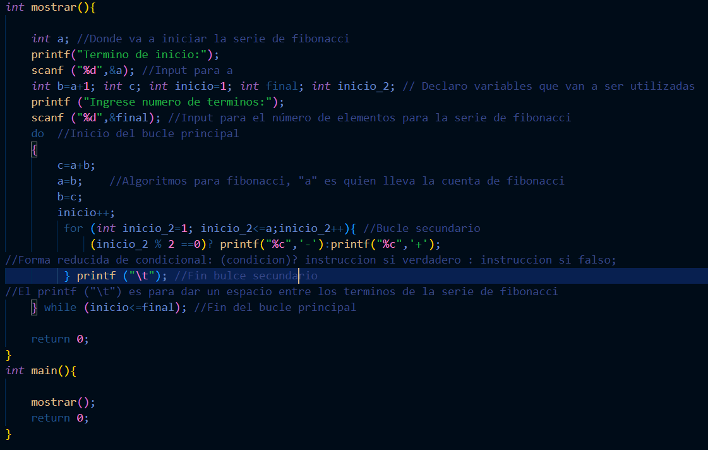

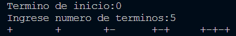

5. Imprima en la consola "- ++ --- ++++" ... sucesivamente.

- Ya te la sabes , solo tienes que hacer un bucle dentro de otro bucle que contenga un condicional que alterne entre los caracteres con algunas variaciones.

**Resolución:**
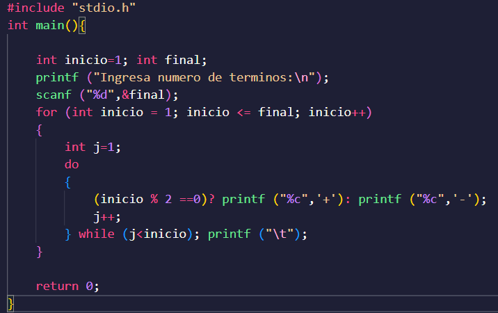

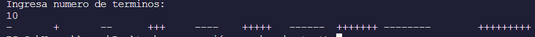

### Imprimir dibujos

¿Sabías que puedes crear un plano cartesiano usando dos bucles anidados?

Si:

        #include "stdio.h"
        int main()
        { 
        for (int i=0; i<size; i++){
            
            for (int j=0; j<size; j++){
                //Poner condicional
        }
        } printf ("\n") 
        return 0;
        }

El bucle anidado se representaría: *(0, 0 1 2)\n; (1; 0 1 2)\n; (2; 0 1 2)\n*, tal que se tienen los siguientes **pares ordenados**: 

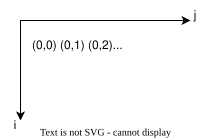
*Si esto no es algebra lineal, no se qué lo será*

**Advertencia**: *para esta funcionalidad, prioriza utilizar la estructura "for" y empezar cada bucle desde 0, para evitar problemas de indexación*.

Puedes jugar con este *plano cartesiano* y un condicional para imprimir diferentes figuras y letras en la consola. por ejemplo, si elijes un tamaño de 4x4 *(el tamaño es el término despues de "<" en cada bucle)*, puedes dibujar una "X" con el siguiente condicional

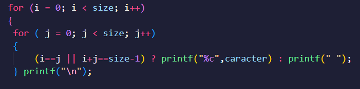
*"||" dentro de un condicional marcan una disyunción y "&&" una conjunción*

*Nótese que las condiciones puestas son la definción matemática para la diagonal principal y secundaria de una matriz en Álgebra Lineal.*

Para dibujar una "P":

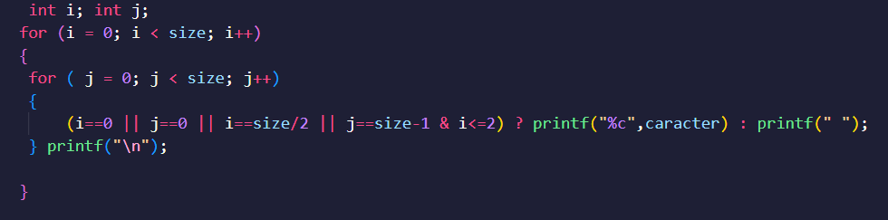
*En este caso las lineas verticales y horizontales se dibujan como en una plano cartesiano, tomar en cuenta que los bucles no cuentan hasta el "tamaño" sino hasta un número menor, razón que para dibujar la linea vertical a la última columna se utiliza "size-1"*.

### Barra de carga

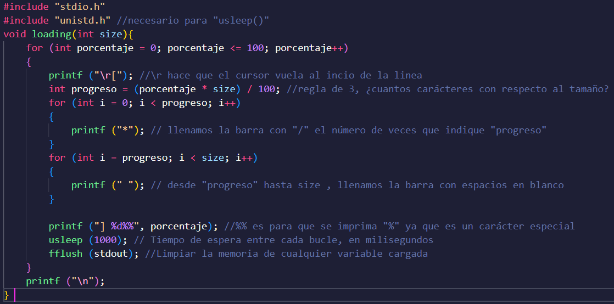

- *Para este ejercicio se necesita primero exportar la libreria "unistd.h" que nos permitira ejecutar la instrucción "usleep()".*
- *Buscamos generar primero un bucle que haga que nuestro porcentaje varie de 0 a 100, pero el número de elementos que se representarán en nuestra barra no necesariamente será 100 por lo que debemos utilizar una regla de 3 para llegar a la equivalencia de qué número de carácteres se deben mostrar en la barra de carga.*
- *El siguiente bucle cargará una serie que va desde o hasta el número de carácteres que se haya calculado hasta arriba, y se imprimira en la pantalla el símbolo selecionado.*
- *El siguiente bucle cargará otra serie desde el número de carácteres hasta el tamaño de la barra de carga, y se imprimirá un caracter vacio; de tal forma que la barra se rellene hasta un porcentaje lleno pero se mantenga vacia la parte que no se ha cargado.*
- *Antes y despues de iniciar estos dos bucles hay dos "printfs", uno dedicado a imprimir "[" con una condición especial "\r" y otro dedicado a imprimir "]" junto con el porcentaje de carga en el que nos encontremos en dicho momento.*
- *En realidad el "\r" hace que el cursor vuelva al inicio de la linea, por lo que cada vez que los bucle avanzan, la barra no se está cargando sino que se esta borrando y rescribiendo constantemente, lo que da la impresión de que se está cargando. La acción de la función usleep(milisegundos) es la de retrasar cada bucle por un tiempo determinado para ayudar a la impresión de la barra de carga.*

Puedes guardar tu código en una librería para poder reutilizarlo de formas muy interesantes más adelante. Por ejemplo, puedes utilizar la función de imprimir letras junto con las barras de carga para hacer un lindo programa:

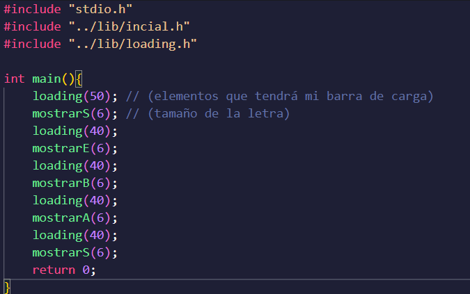

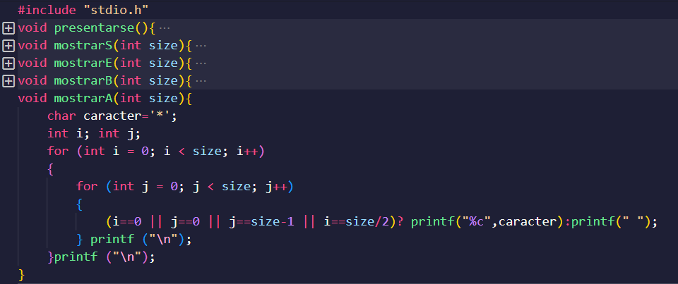


>>27 de mayo de 2025, claase 14 de Programación I

### Arrays (dos dimensiones)

Para declarar una matriz en c/c++ se debe seguir las siguiente estructura:

    data_type array_name[i][j]={
    {a,b,c},
    {d,e,f}
    }

donde *"i"* y *"j"* son los números de filas y columnas de la matriz, respectivamente.

Es importante aclarar que si no vamos a llenar la matriz de datos inmediatamente o si la queremos llenar en torno a un bucle o secuencia debemos primero encerar una matriz por medio de un bucle:

**Para una matriz fila**:

    for (int a=0; a < i; a++)
        array[a]= 0;

Buscamos que la matriz se llene de ceros, antes de meter otros valores en ella para evitar problemas en los espacios de memoria asignados a la matriz,

**Para una matriz fila x columna**:

    for (int a=0; a < i; a++)
        for(int b=0; b<j; b++)
            array[a][b]=0;

*Importante recordar que los índices de los arreglos se enumeran desde "0"*

Para proceder a llenar estos arreglos de manera estructurada podemos utilizar los mismos bucles.

Declarar una cadena de caracteres en c/c++ se hace de la siguiente manera:
    char *string[];
    char string[255];

Si no sabes cuál será el tamaño del arreglo, puedes utilizar el asterísco; si sabes el tamaño aproximado que puede tener puedes ponerlo en la declaración.

## Automatas y Máquinas de estado

Planteemos un pequeño problema, queremos hacer un programa encargado de monitorear el comportamiento de un virus mediante las siguientes reglas:

- El virus originalmente se encuentra en un estado de "0" con una temperatura por defecto.
- Si la temperatura aumenta, el virus muta a "1".
- Si la temperatura aumenta cuando el virus esta en "1", sique en el mismo estado.
- Si la temperatura disminuye, el virus muta a "2".
- Si la temperatura disminuye cuando el virus esta en "2", sique en el mismo estado.
- Si el virus se encuentra en "0" y se le da la proteina "a" muta a "3".
- Si el virus se encuentra en "1" y se le da la proteina "b" muta a "3".
- Si el virus está en "2" y se le da la proteina "c" muta a "3".
- Si el virus se encuentra en "3" y se le da la proteina "a" no muta.
- Si el virus se encuentra en "0" y se le da una proteina "x" tampoco muta.
- Toda instrucción no contemplada hace que el virus muera.

En el programa, el usuario metería alguna instrucción para el virus, y el programa debería mostrar el estado del virus después de la instrucción.

Si intentáramos programar estas instrucciones de manera lineal, el programa sería muy largo y difícil de entender. Asi que vamos a intentar solucionar este problema mediante la teoría de Grafos.

### Simbología

- **Q={q_n}**: Esta es la matriz de estados del virus.
- **Σ={a, b, c, x, t}**: Esta es la matriz de instrucciones o Alfabeto que se pueden dar al virus (aumentar temp, disminuir temp o dar proteinas).
- **δ = Q x Σ**: Matriz de transiciones del virus (resultados despues de ejecutar cada instrucción), sus filas sera *Q* y sus columnas será *Σ*.
- **W={w}**: Son todas las combinaciones posibles de instrucciones que se pueden dar al virus (algunas son no válidas y lo matarán).
- **L=lenguaje**: Son todos los *W* válidos que se pueden dar al virus.

Antes de proceder a resolver el problema es importatne graficar el grafo que lo representa para tener una mejor comprensión del funcionamiento del virus.

<!-- 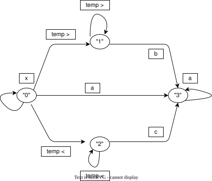 -->

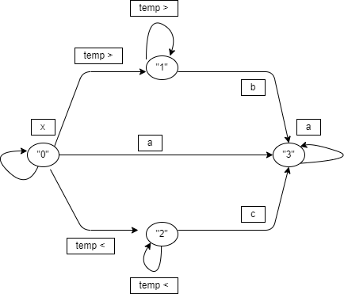

Por cuestiones de espacio, algunas instrucciones se redujeron a meros símbolos tales como < o > para indicar aumento y disminución en la temperatura, los numeros para indicar los diferentes estados de mutación del virus y las letras para indicar las proteinas.

**Advertencia:** *otro aspecto a tomar en cuenta es que el siguiente método de resolución no funcionará si es que la misma instrucción sale dos o más veces de un mismo estado.*

Para empezar a resolver tenemos que armar nuestras matrices de estados y nuestro Alfabeto con lo que tenemos; usaremos la simbología del gráfico.

    enumm {q0=0,q1,q2,q3} mutacion=q0; //Matriz de estados
    char A[]{'x','<','>','a','b','c',' ','\n'}; //Alfabeto
    
Para llenar la matriz de transiciones **δ = Q x Σ** debemos observar las cosencuencias de cada instrucción en cada mutación, por ejemplo:

-  δ0(q0,>)= q1
-  δ1(q1,b)= q3
-  δ3(q0,x)= q0
-  etc..

Una forma más facil de hacerlo sería mediante la siguiente tabla:

| Estado | x | > | < | a | b | c | '' | \n |
|:------:|:-:|:-:|:-:|:-:|:-:|:-:|:---:|:--:|
|  q0    | 0 | 1 | 2 | 3 |   |   |  0  | 0  |
|  q1    |   | 1 |   |   | 3 |   |  1  | 1  |
|  q2    |   |   | 2 |   |   | 3 |  2  | 2  |
|  q3    |   |   |   | 3 |   |   |  3  | 3  |

Todos los espacios en blanco son instrucciones no contempladas por lo que en esos espacios se podría decir que ha muerto, a la hora de llenar la matriz en c/c++ podemos rellenar dichos espacios con algun término que no se vaya a utilizar. Tambien se han aumentado *' '* y *'\n'* como instrucciones del Alfabeto, en ellas ponemos los estados correspondientes respecto a la fila en que nos encontremos.

    int Mt[4][8] = {
    {0, 1, 2, 3, -1, -1, 0, 0},  // q0
    {-1, 1, -1, -1, 3, -1, 1, 1}, // q1
    {-1, -1, 2, -1, -1, 3, 2, 2}, // q2
    {-1, -1, -1, 3, -1, -1, 3, 3}  // q3
    };

**Nota**: Se ha reemplazado los terminos nulos (espacios en blanco de la matriz) por '-1'.

Lo que acbamos de hacer es armar una matriz que comtempla toda las posibles instrucciones (matriz W) que se le pueden dar a los diferentes estados asi como sus diferentes resultados.

A partir de esta matriz ya podemos empezar a programar, necesitaremos:

- El usuario debe empezar ingresando una instrucción sea válida o invalida.
- Debe haber un diccionario que revise si la instrucción proporcionada existe.
- Hacer un bucle que muestre los diferentes *q_n* para una misma instrucción hasta que el virus "muera".

>6 de junio

## Validacion de un Mail

Para este caso se van a manejar los siguientes conjuntos:

**l[i]**: Esta matriz contiene todas las letras a utilizar en el email.

    l[i]={'a','b'...'z','A','B',...'Z'} 

**\+/\***:"*+*" representará el número de veces que se repetirá algún caracter de  de "*l[i]*", mientras que "*\**" representará algún caracter ya sea "*_*" o "*-*" dentro del mail.

    +[i]={'1','2','3',...n}
    *[i]={'_','-','*',etc}

**d**: Albergará el dominio del email a verificar.

    d={@dominio.com}

El objetivo para este tipo de problemas será desarrollar un "*input*" en el cual meter una cadena de caracteres para verificarse.

### Representación en grafo

En el input, el usario podrá meter diferentes combinaciones que pueden ser ejemplificadas y representadas como:

**l[i]l[i],l[i]+/_l[i]+@d**

*considerar que la barra inclinada "/" es hace disyunción dentro de esta representación ya que una letra puede estar seguida de otra o simplemente ser reemplazada por otro tipo de caracter. Considerar tambien que repetir una letra no hace que el estado del autómata "suba"*.

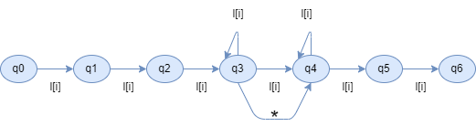

Dado:

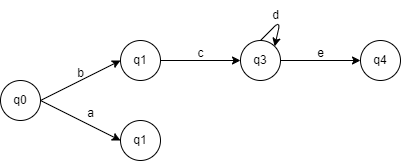

podemos interpretr algunas instrucciones instrucciones dadas:

    w1= bcddde
    w2= bce
    w3= a

## Tipos, operadores y expresiones

    char s[]="125"
    int i=atoi(s);
    isdigit(/*poner un caracter*/);

- **atoi()**: Transforma una variable dada a un entero
- **isdigit()**: Devueleve un valor de verdadero o falso para saber si una variable dada es entero.

### Algunas librerias nuevas (para C++)

    #include "iostream"
    int main(int argc, cahr *argv[])
    std::cout << "Hola Mundo" << std::endl;

**iostream** es una librería que denota una forma alternativa de imprimir "Hola mundo"; *std::out* selecciona la función *out* de la librería estandar (comunmente conocida como *printf*) y std::endl marca el fin de la linea (*\n*); naturalmente, la funcion *std::cin* corresponderá a la función *scanf*.

    include "iostream"
    using namespace std;
    int edad=0;
    cout << "Ingrese la edad: ";
    cin >> edad;

He aqui un ejemplo:

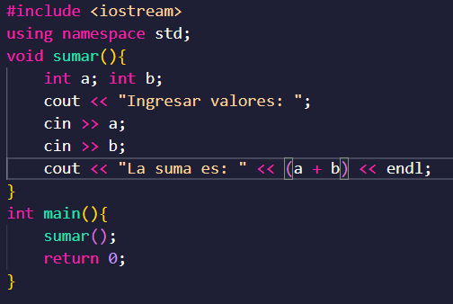

